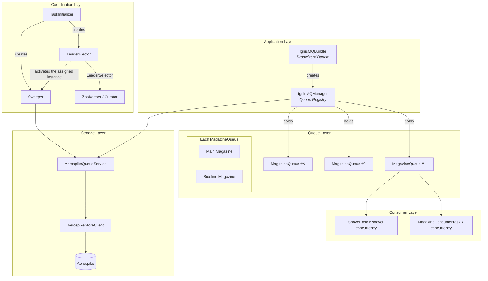
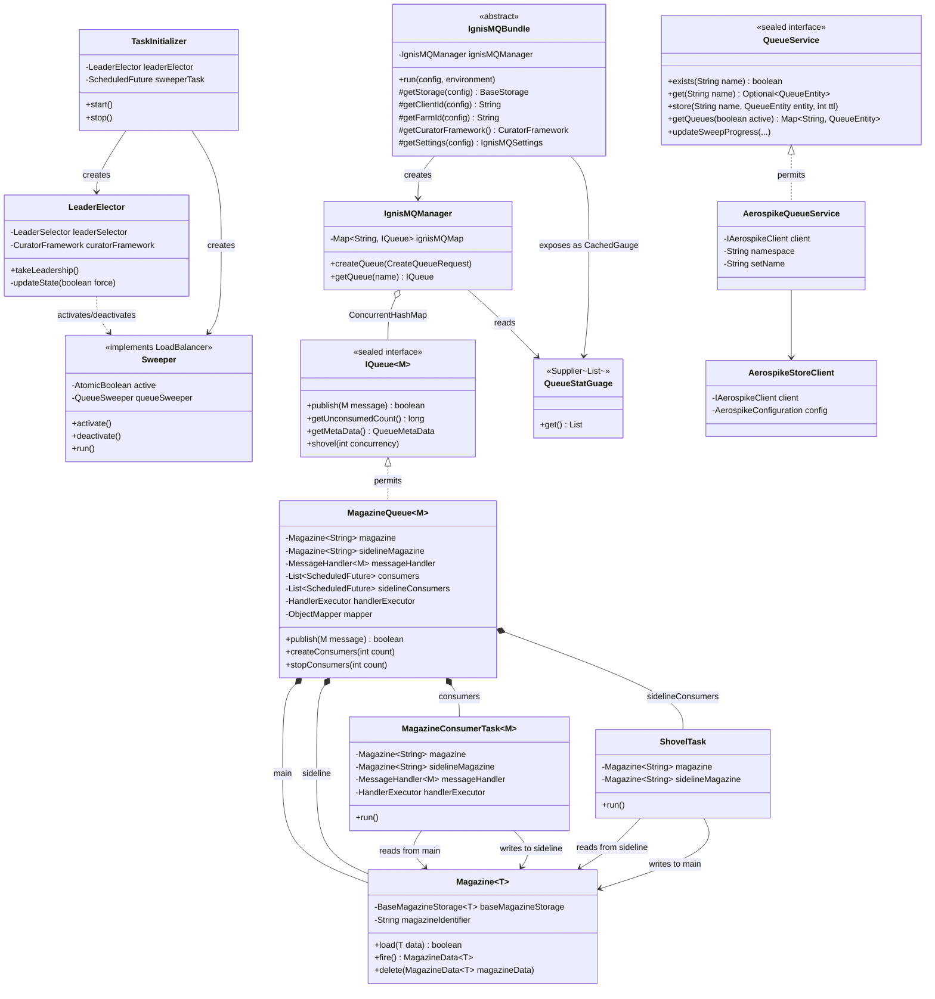
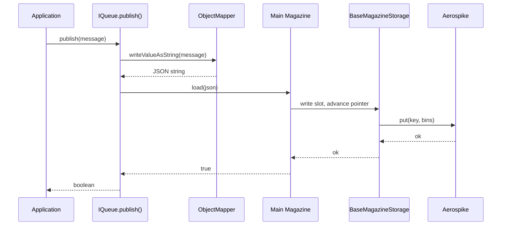
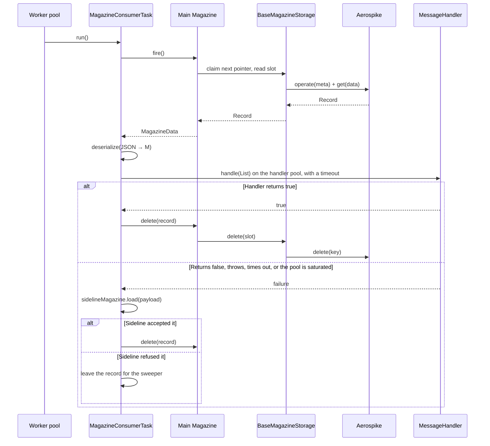
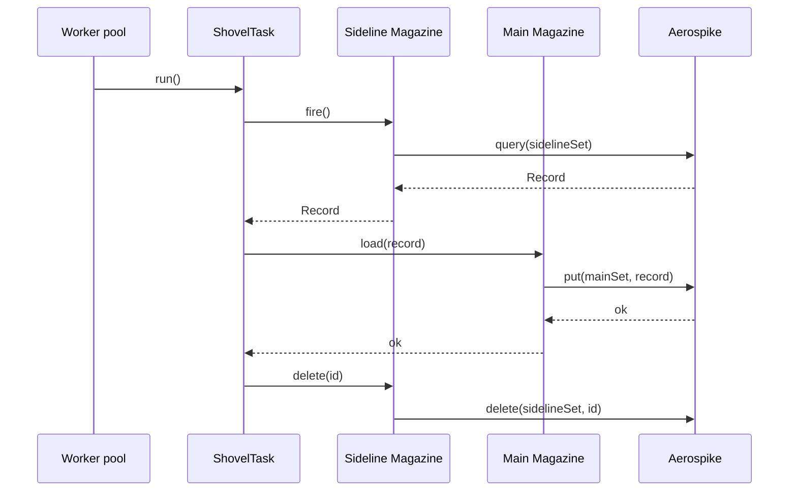
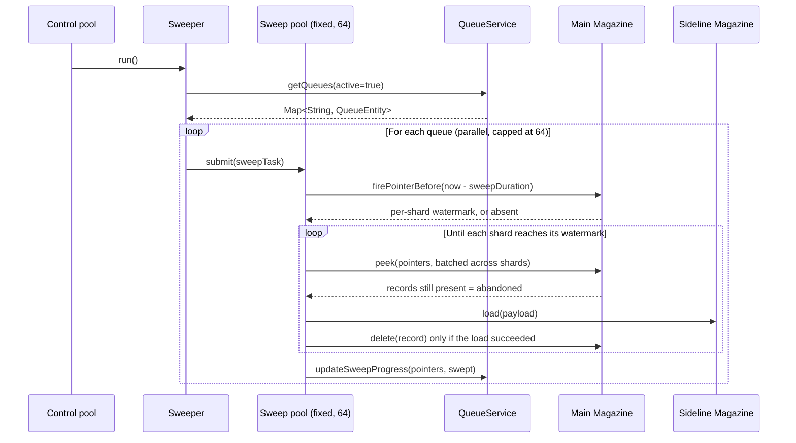
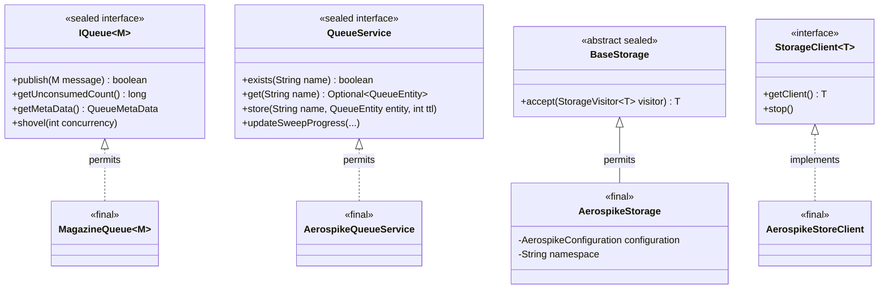
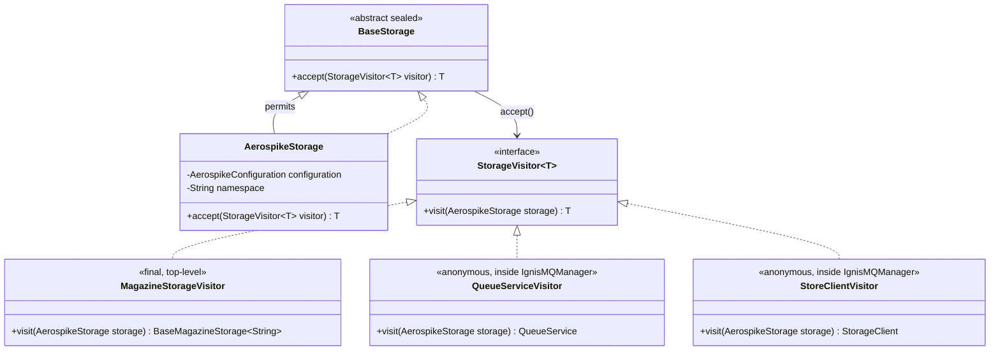
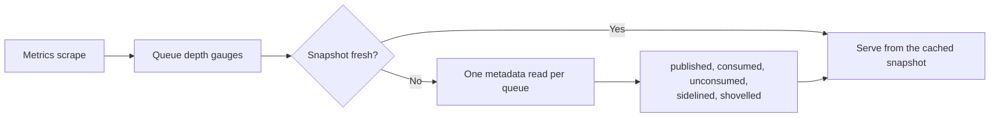
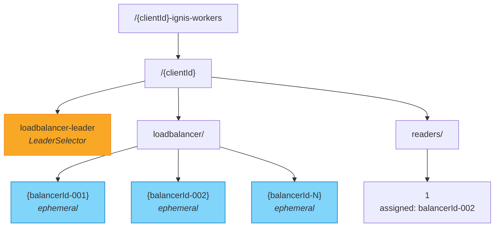

# Architecture

This page provides a deep dive into the internal architecture of IgnisMQ — its components, threading model, data flows, type hierarchy, and operational mechanics.

---

## 1. System Overview

IgnisMQ is structured in distinct layers, each with a clear responsibility.



!!! info "Layered Design"
    Each layer only communicates with its immediate neighbours. The application layer never touches storage directly — it always goes through the queue abstraction.

---

## 2. Component Relationships



!!! note "ConcurrentHashMap"
    `IgnisMQManager` holds its queues in `ignisMQMap`, a `Map<String, IQueue<?>>` backed by a `ConcurrentHashMap`. This allows thread-safe registration and lookup at runtime.

---

## 3. Threading Model

!!! warning "Rewritten in 2.0"
    IgnisMQ used to run one `java.util.Timer` thread per consumer, per shovel, plus one each for the
    watcher and sweeper. A queue with 8 consumers and 2 shovels cost 10 threads on scheduling alone.
    Everything is now a task on one of three shared pools.

### The three pools

| Pool | Size | Runs | Isolation rationale |
|---|---|---|---|
| **Control** | Fixed at 2 | Queue watcher, sweeper | The control plane. The watcher is how a queue created elsewhere becomes consumable here; the sweeper is the only thing that rescues messages from a dead consumer. Neither may be starved by the data plane it supervises |
| **Worker** | Grows to `workerThreads` (256) | Consumers, shovels | Shovels belong here, not with the watcher: they are per-queue, configurable and do storage I/O — the same class of work as a consumer. A third pool would add threads and a knob without buying isolation that matters |
| **Handler** | Up to `workerThreads` | User `MessageHandler` code only | The only way to bound how long a worker waits for arbitrary user code is to not run it on that thread |

Sharing one pool coupled control with data: enough slow consumers and the watcher silently stops
refreshing queues while the sweeper stops recovering orphans.

### Schedule summary

| Component | Scheduled on | Initial delay | Period |
|---|---|---|---|
| **Consumer task** | Worker | 1 s | 1 s fixed delay |
| **Shovel task** | Worker | 1 s | `timeIntervalInSecs`, default 600 s |
| **Queue watcher** | Control | 1 min | 5 min |
| **Sweeper** | Control | 10 min | 15 min |
| **Leader election** | Its own Curator threads | — | 30 s state poll |
| **Sweep fan-out** | Fixed pool, `PARALLEL_FACTOR = 64` | — | Per pass, across queues |

Fixed **delay**, not fixed rate: the gap is measured after a task finishes, so a slow consumer never
has runs queued up behind it.

### What bounds a thread

The split bounds the blast radius of a badly behaved handler; it does not make the worker pool immune
to one. Three mechanisms do that:

| Mechanism | Value | Closes |
|---|---|---|
| **Consumer run budget** | 30 s | A backlogged queue holding a worker thread forever. The consumer yields and resumes next run; a batch in hand is always finished first, so the budget never costs a delivery |
| **Handler timeout** | `handlerTimeoutInMins`, clamped to half of `sweepDuration` | A hung handler holding a worker, and the duplicate-processing window where the sweeper re-homes a record the handler is still working on |
| **Saturation refusal** | 1 s grace, then refuse | Running a batch inline with no bound when the handler pool is exhausted. The batch is sidelined under `reason=saturated` instead |

!!! note "`concurrency` is a target, not a thread count"
    For a queue with `concurrency = 8` and `shovelConcurrency = 2`, IgnisMQ schedules **10 tasks**
    that share the worker pool — not 10 threads. Size `workerThreads` as concurrently active queues
    times their concurrency.

---

## 4. Data Flow

### 4.1 Publish Flow



### 4.2 Consume Flow



### 4.3 Shovel Flow



### 4.4 Sweep Flow



!!! tip "How the sweeper knows a message is old enough"
    It does not read a timestamp from the message — there is no longer one to read. Magazine reports
    where each shard's fire pointer stood at a past moment, so everything at or below that pointer was
    claimed at least `sweepDuration` ago. See
    [delivery-time watermarks](backends/aerospike.md#delivery-time-watermarks).

    If the retained checkpoint history does not reach back far enough, the sweeper **refuses the pass
    and logs an error** rather than guessing. Alert on `ignismq.sweep{outcome=failure}`.

---

## 5. Sealed Type Hierarchy

IgnisMQ uses Java 17 sealed types to enforce a closed set of implementations.



!!! info "Why Sealed Types?"
    Sealed types provide exhaustiveness guarantees at compile time. When you pattern-match on `IQueue`, the compiler knows the only possible implementation is `MagazineQueue`. This makes the codebase safer to extend — adding a new storage backend requires updating all `permits` clauses and their consumers.

---

## 6. Visitor Pattern

IgnisMQ uses the visitor pattern to decouple storage construction from storage type specifics.



**How it works:**

1. `IgnisMQManager` receives a `BaseStorage` instance (which is actually `AerospikeStorage`).
2. To build a `QueueService`, it calls `storage.accept(...)` with an anonymous `StorageVisitor`.
3. `AerospikeStorage.accept()` dispatches to `visitor.visit(this)`.
4. The visitor has access to the concrete `AerospikeStorage` fields and constructs `AerospikeQueueService`.

!!! note "Two of the three visitors have no name"
    `QueueServiceVisitor` and `StoreClientVisitor` above are labels for readability, not types — in
    source both are anonymous `new StorageVisitor<>() { ... }` expressions inside
    `IgnisMQManager.buildQueueCommands` and `buildStorageClient`. Only `MagazineStorageVisitor` is a
    real named type, and it is **top-level rather than nested in `MagazineQueue`**: the sweeper needs
    the same storage recipe, and having a queue type own it made the sweep package depend back on the
    queue package. That is a genuine cycle, and the architecture rules reject it.

The `Magazine` instances themselves are built through `MagazineStorageVisitor`, which returns a
`BaseMagazineStorage<String>` — the storage a `Magazine` is constructed on, not a `Magazine`.

!!! note "Extensibility"
    To add a new storage backend (e.g., Redis), you would: (1) create `RedisStorage extends BaseStorage`, (2) add `visit(RedisStorage)` to `StorageVisitor`, (3) implement the visitor methods. The sealed hierarchy ensures you cannot forget any call site.

---

## 7. Metrics

Core records metrics through Micrometer. `ignismq-dw-bundle` bridges them into the application's
Dropwizard `MetricRegistry` and supplies Dropwizard-specific gauges and lifecycle adapters.
`ignismq-core` has no Dropwizard dependency at any scope, and an enforcer rule fails the build if one
appears.

### Registered metrics

Full definitions, tags and semantics: **[Metrics](api/metrics.md)**. In outline:

| Meter family | Covers |
|---|---|
| `ignismq.publish`, `ignismq.consume`, `ignismq.messages`, `ignismq.poll`, `ignismq.sideline` | The message path |
| `ignismq.handler.*` | Duration, batch size, timeouts, saturation |
| `ignismq.queue.*` | Depth and lifetime counters, as gauges from one cached snapshot |
| `ignismq.sweep*`, `ignismq.shovel*`, `ignismq.queue.refresh`, `ignismq.queue.create` | Control plane |
| `ignismq.pool.*` | Control and worker pool saturation |
| `magazine.*` | Magazine's own instrumentation, tagged by magazine and outcome |
| `ignis.queue.stats` | Bundle only: a Dropwizard `CachedGauge`, 3 minute TTL |

Every dimension is a tag rather than part of the name, so a queue is a tag value and not a new meter.

Dropwizard has no notion of tags, so the bundle's bridge flattens each Micrometer tag into the metric
name. `magazine.fire.outcomes` tagged `magazine=orders, outcome=delivered` is published as
`magazine.fire.outcomes.magazine.orders.outcome.delivered`.

### The queue-stat gauges



Depth is the one value that costs a storage read, so all five gauges for a queue share a single
refresh rather than each triggering their own. Without that, a scrape would cost one metadata read
per queue **per meter**.

### What happened to `commands.*`

Earlier versions wove `@MonitoredFunction` timers into most public methods with AspectJ. That was
removed along with the Dropwizard coupling: it pulled AspectJ and a build-time weaving step into
`ignismq-core`, and the resulting timers measured method entry and exit rather than anything
operationally meaningful.

The two that were worth keeping — publish and consume latency — are now `ignismq.publish` and
`ignismq.consume`, with the queue as a tag. **The rest of the `commands.*` namespace is gone**, and
nothing is aliased: see the [upgrade notes](upgrading.md).

---

## 8. ZooKeeper Node Structure

IgnisMQ uses ZooKeeper (via Apache Curator) for leader election and work distribution among instances.

```
/{clientId}-ignis-workers/
  └── {clientId}/
      ├── loadbalancer-leader          ← LeaderSelector (persistent node)
      │                                  Only one instance holds leadership.
      │                                  The leader assigns the sweep
      │                                  partition; the assigned instance
      │                                  runs the Sweeper, leader or not.
      │
      ├── loadbalancer/
      │   └── {balancerId}             ← Ephemeral nodes, named by the
      │                                  instance's balancerId UUID.
      │                                  Not sequential: the UUID is
      │                                  already the identity.
      │
      └── readers/
          └── {partition}              ← Communicator nodes.
                                         Each partition stores the
                                         assigned balancerId, mapping
                                         partitions to instances.
```



**Leader election flow:**

1. Each instance creates an ephemeral node under `loadbalancer/`.
2. Curator's `LeaderSelector` competes for `loadbalancer-leader`.
3. The winning instance calls `takeLeadership()`, which forces an immediate reassignment pass. Leadership is what makes an instance the *assigner*; it is not what activates a sweeper.
4. The leader reassigns partitions across live balancer nodes by round-robin, writing each assignment into that partition's node under `readers/`. It rewrites them only when membership changes, or on the forced pass taken at step 3.
5. Every instance **polls** its assignment every 30 seconds - these nodes are read, not watched - and the instance whose `balancerId` matches activates its `Sweeper`. That may or may not be the leader, and activation can lag a reassignment by up to 30 seconds.
6. When the leader dies, its ephemeral node disappears and Curator triggers a new election.

!!! warning "ZooKeeper Dependency"
    ZooKeeper is required for multi-instance deployments. In single-instance mode, the instance always becomes the leader. If ZK is unavailable, sweeping and partition rebalancing will stall — but publish and consume continue to work.
