# Architecture

This page provides a deep dive into the internal architecture of IgnisMQ — its components, threading model, data flows, type hierarchy, and operational mechanics.

---

## 1. System Overview

IgnisMQ is structured in distinct layers, each with a clear responsibility.

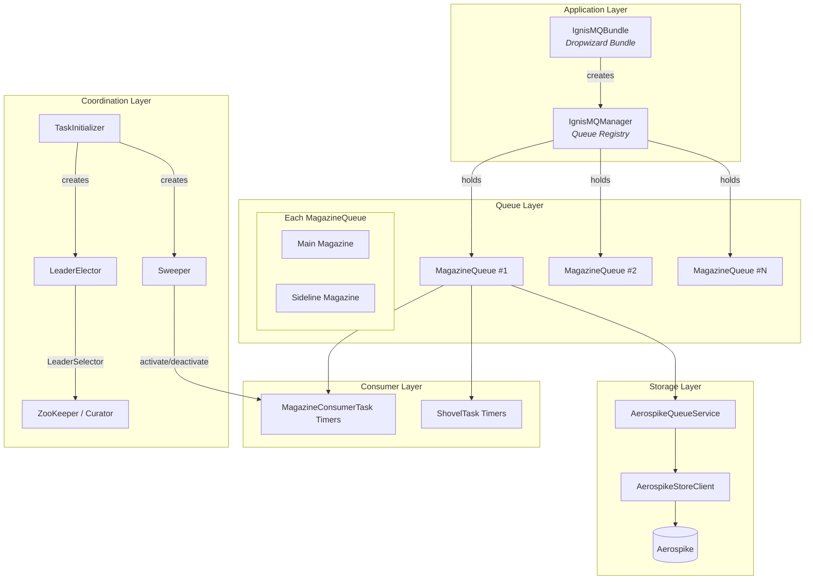

!!! info "Layered Design"
    Each layer only communicates with its immediate neighbours. The application layer never touches storage directly — it always goes through the queue abstraction.

---

## 2. Component Relationships

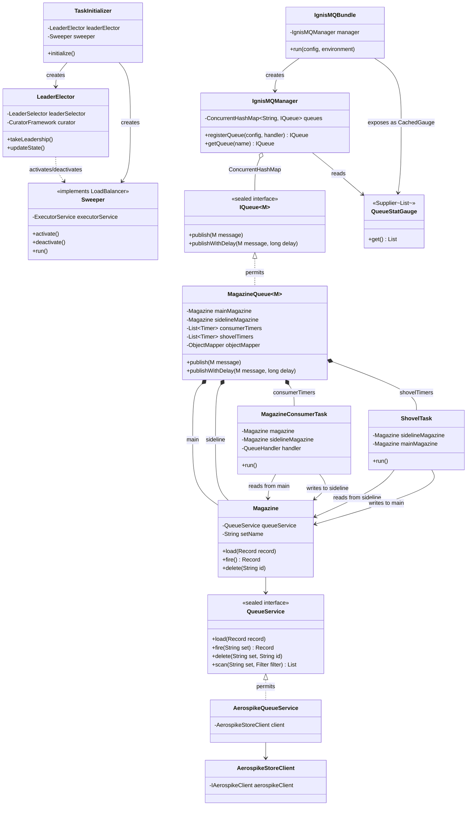

!!! note "ConcurrentHashMap"
    `IgnisMQManager` uses a `ConcurrentHashMap<String, IQueue>` to hold all registered queues. This allows thread-safe registration and lookup at runtime.

---

## 3. Threading Model

IgnisMQ relies heavily on `java.util.Timer` threads and a shared `ForkJoinPool` for background work.

### Timer Schedule Summary

| Component | Count | Initial Delay | Period | Notes |
|---|---|---|---|---|
| **Consumer Timer** | 1 per concurrency slot | 2 min | 1 sec | `Timer.schedule(task, 120_000, 1_000)` |
| **Shovel Timer** | 1 per shovel concurrency | 2 min | `timeIntervalInSecs × 1000` | Configurable interval |
| **Watcher Timer** | 1 global | 1 min | 5 min | `Timer.schedule(refreshQueues, 60_000, 300_000)` |
| **Sweeper Timer** | 1 global | 10 min | 15 min | `Timer.schedule(sweeper, 600_000, 900_000)` |
| **Leader Election** | 1 global | — | 30 sec poll | `updateState()` polling loop |
| **Sweeper Executor** | ForkJoinPool | — | — | `parallelism = 64`, used for parallel queue sweeps |

```mermaid
gantt
    title IgnisMQ Timer Startup Timeline
    dateFormat ss
    axisFormat %S s

    section Consumers
    Initial delay (2 min)           :done, c_delay, 00, 120s
    Consumer fires every 1s         :active, c_run, after c_delay, 30s

    section Shovels
    Initial delay (2 min)           :done, s_delay, 00, 120s
    Shovel fires every N sec        :active, s_run, after s_delay, 30s

    section Watcher
    Initial delay (1 min)           :done, w_delay, 00, 60s
    Watcher fires every 5 min       :active, w_run, after w_delay, 30s

    section Sweeper
    Initial delay (10 min)          :done, sw_delay, 00, 600s
    Sweeper fires every 15 min      :active, sw_run, after sw_delay, 30s

    section Leader Election
    Curator LeaderSelector           :active, le, 00, 30s
    updateState poll (30s loop)      :active, le2, after le, 30s
```

!!! warning "Thread Counts"
    For a queue with `concurrency = 8` and `shovelConcurrency = 2`, IgnisMQ spawns **10 Timer threads** for that single queue alone. Plan your concurrency settings carefully.

---

## 4. Data Flow

### 4.1 Publish Flow

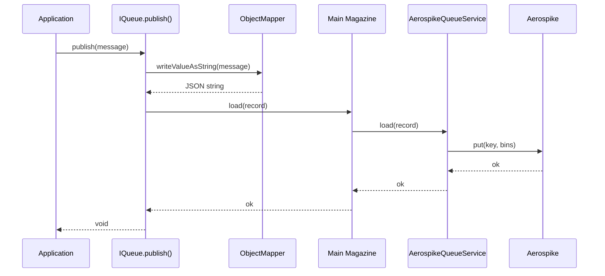

### 4.2 Consume Flow

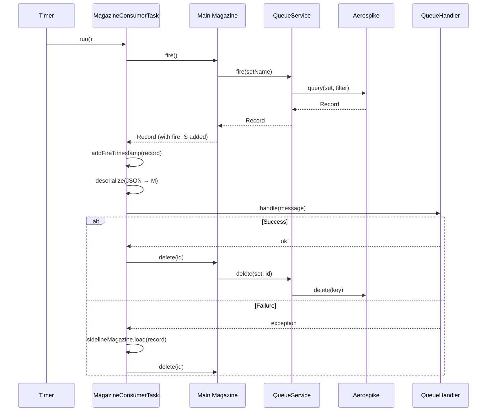

### 4.3 Shovel Flow

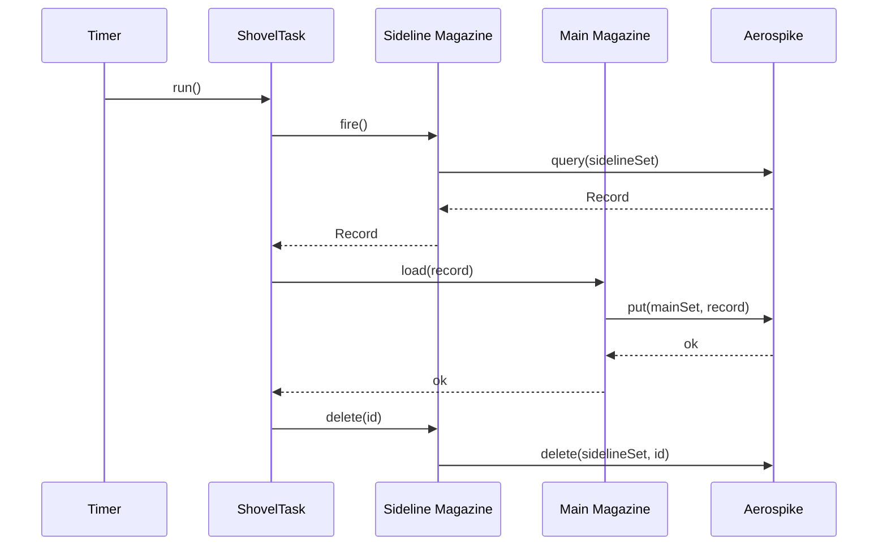

### 4.4 Sweep Flow

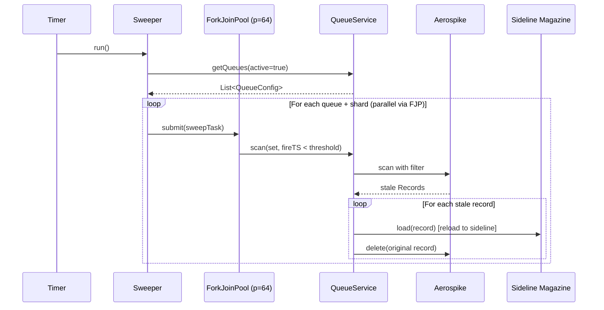

!!! tip "Sweep Threshold"
    The sweeper scans for records whose `fireTS` is older than a configurable threshold. These are messages that were dequeued (fire timestamp set) but never successfully processed or deleted — indicating a crashed consumer.

---

## 5. Sealed Type Hierarchy

IgnisMQ uses Java 17 sealed types to enforce a closed set of implementations.

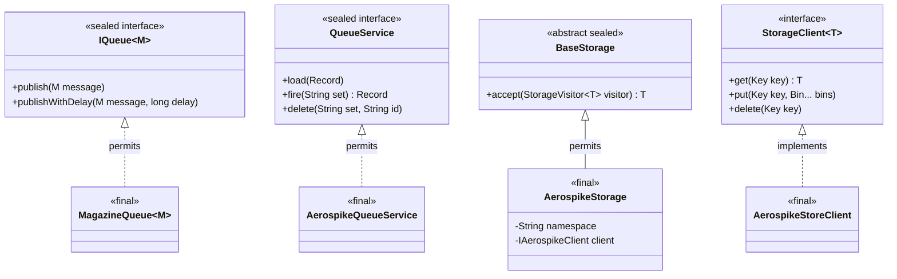

!!! info "Why Sealed Types?"
    Sealed types provide exhaustiveness guarantees at compile time. When you pattern-match on `IQueue`, the compiler knows the only possible implementation is `MagazineQueue`. This makes the codebase safer to extend — adding a new storage backend requires updating all `permits` clauses and their consumers.

---

## 6. Visitor Pattern

IgnisMQ uses the visitor pattern to decouple storage construction from storage type specifics.

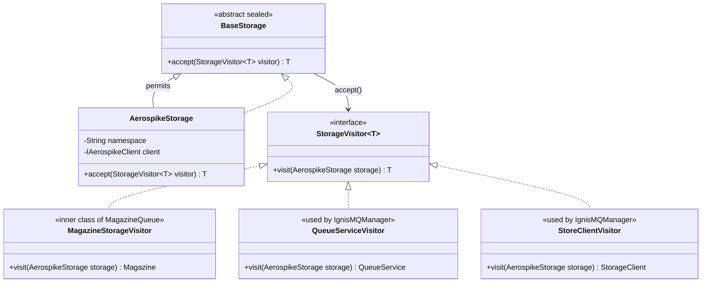

**How it works:**

1. `IgnisMQManager` receives a `BaseStorage` instance (which is actually `AerospikeStorage`).
2. To build a `QueueService`, it calls `storage.accept(new QueueServiceVisitor())`.
3. `AerospikeStorage.accept()` dispatches to `visitor.visit(this)`.
4. The visitor has access to the concrete `AerospikeStorage` fields and constructs `AerospikeQueueService`.

The same pattern is used inside `MagazineQueue` — `MagazineStorageVisitor` builds the `Magazine` instances from the concrete storage.

!!! note "Extensibility"
    To add a new storage backend (e.g., Redis), you would: (1) create `RedisStorage extends BaseStorage`, (2) add `visit(RedisStorage)` to `StorageVisitor`, (3) implement the visitor methods. The sealed hierarchy ensures you cannot forget any call site.

---

## 7. Metrics

Core records metrics through Micrometer. `ignismq-dw-bundle` bridges them into the application's
Dropwizard `MetricRegistry` and supplies Dropwizard-specific gauges and lifecycle adapters.

### Registered Metrics

| Metric Name Pattern | Type | Description |
|---|---|---|
| `commands.{queueName}_publish.all` | Timer | Latency and throughput of publish operations |
| `commands.{queueName}_consume.all` | Timer | Latency and throughput of consume operations |
| `magazine.*` | Counters and timers | Magazine's own instrumentation, tagged by magazine and outcome |
| `ignis.queue.stats` | CachedGauge (3 min TTL, bundle only) | Reports `published`, `consumed`, `unconsumed`, `sidelined`, `shovelled` counts |

Dropwizard has no notion of tags, so the bundle's bridge flattens each Micrometer tag into the
metric name. `magazine.fire.outcomes` tagged `magazine=orders, outcome=delivered` is published as
`magazine.fire.outcomes.magazine.orders.outcome.delivered`. Untagged meters, including the
`commands.*` timers above, keep their names unchanged.

### QueueStatGauge

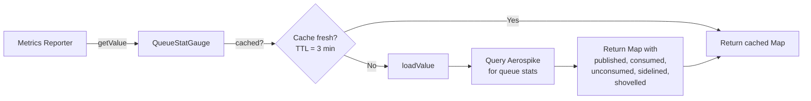

### Method-level metrics

Earlier versions wove `@MonitoredFunction` timers into most public methods with AspectJ. That was
removed along with the Dropwizard coupling: it pulled AspectJ and a build-time weaving step into
`ignismq-core`, and the resulting timers measured method entry and exit rather than anything
operationally meaningful. Deliberate instrumentation is being added back in its place; until then
the `commands.*` timers and Magazine's `magazine.*` meters are the supported surface.

---

## 8. ZooKeeper Node Structure

IgnisMQ uses ZooKeeper (via Apache Curator) for leader election and work distribution among instances.

```
/{clientId}-ignis-workers/
  └── {clientId}/
      ├── loadbalancer-leader          ← LeaderSelector (persistent node)
      │                                  Only one instance holds leadership.
      │                                  Leader runs the Sweeper.
      │
      ├── loadbalancer/
      │   └── {balancerId}             ← Ephemeral sequential nodes.
      │                                  Each running IgnisMQ instance
      │                                  registers itself here.
      │
      └── readers/
          └── {partition}              ← Communicator nodes.
                                         Each partition stores the
                                         assigned balancerId, mapping
                                         partitions to instances.
```

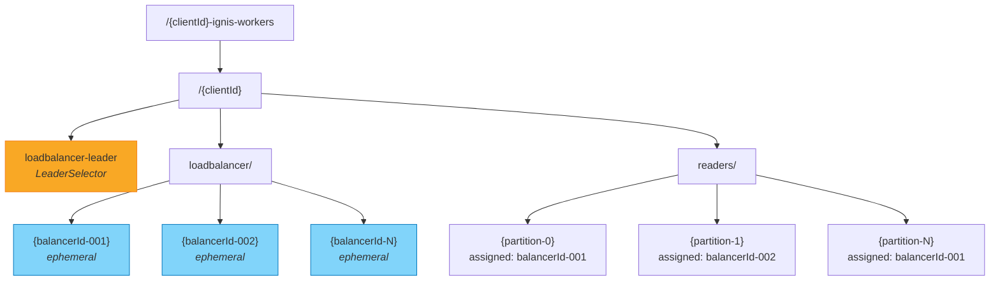

**Leader election flow:**

1. Each instance creates an ephemeral node under `loadbalancer/`.
2. Curator's `LeaderSelector` competes for `loadbalancer-leader`.
3. The winning instance calls `takeLeadership()`, which activates the `Sweeper`.
4. The leader polls `updateState()` every **30 seconds** to reassign partitions across live balancer nodes.
5. When the leader dies, its ephemeral node disappears and Curator triggers a new election.

!!! warning "ZooKeeper Dependency"
    ZooKeeper is required for multi-instance deployments. In single-instance mode, the instance always becomes the leader. If ZK is unavailable, sweeping and partition rebalancing will stall — but publish and consume continue to work.
