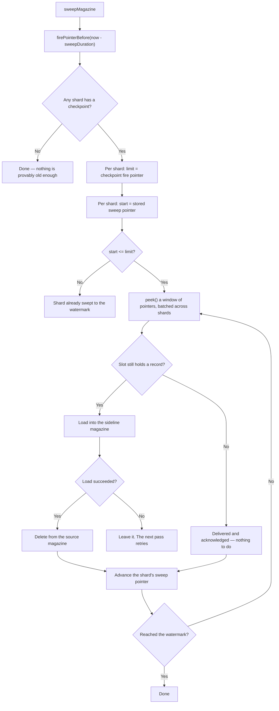

# Aerospike Backend

Comprehensive documentation of the Aerospike storage backend for IgnisMQ.

---

## Overview

IgnisMQ uses Aerospike as its primary storage backend, leveraging the [Magazine](https://github.com/PhonePe/Magazine) library for queue primitives (load/fire operations) and `AerospikeQueueService` for queue metadata management.

The storage layer is split into two concerns:

- **AerospikeStorage** — a thin configuration holder that carries the `AerospikeConfiguration` and namespace, implementing the `BaseStorage` visitor pattern.
- **AerospikeQueueService** — the CRUD for queue metadata and the sweep pointers. It is **not** on the message path: message slots are read and written through Magazine's own storage, not through this class.

---

## Configuration

```java
AerospikeStorage storage = new AerospikeStorage(
    AerospikeConfiguration.builder()
        .hosts(List.of(AerospikeHost.builder()
            .host("localhost")
            .port(3000)
            .build()))
        .retries(3)
        .sleepBetweenRetries(100)
        .socketTimeout(3000)
        .totalTimeout(5000)
        .maxConnectionsPerNode(100)
        .threadPoolSize(4)   // default: availableProcessors * 4
        .build(),
    "my-namespace"
);
```

!!! note "TLS"
    If credentials are configured in `AerospikeConfiguration`, the client will negotiate TLS automatically.

---

### Queue Metadata Set: `{farmId}_{clientId}_ignis_queues`

Each record represents one queue. The Aerospike key is the queue name.

| Bin | Type | Description |
|-----|------|-------------|
| `handlerType` | String | Message handler type identifier |
| `shards` | int | Number of shards for parallelism |
| `queueExpiry` | int | Queue expiry in seconds |
| `messageExpiry` | int | Message TTL in seconds |
| `concurrency` | int | Consumer concurrency |
| `shovelConcur` | int | Shovel concurrency |
| `shovelInterval` | int | Shovel time interval in seconds |
| `createdAt` | long | Creation timestamp (epoch ms) |
| `active` | String | `"true"` / `"false"` — used for secondary index |
| `sweepPointers` | Map&lt;String, Long&gt; | Per-shard sweep pointer positions |
| `sidelineSweep` | Map&lt;String, Long&gt; | Per-shard sideline sweep pointer positions |
| `sweptCounter` | long | Total messages swept from main magazine |
| `sidelineSwept` | long | Total messages swept from sideline magazine |
| `sweepDuration` | long | Sweep look-back duration in milliseconds |
| `handlerTimeout` | long | Handler execution budget in milliseconds. Absent on queues created before 2.0, which fall back to the default rather than to zero |
| `maxBatchSize` | int | Batching config — max batch size (0 = disabled) |
| `maxWaitTime` | int | Batching config — max wait time in seconds (0 = disabled) |

### Magazine Data Sets (managed by Magazine library)

| Set Name Pattern | Purpose |
|------------------|---------|
| `{farmId}_{clientId}_data_set` | Message data records (keyed by `{queueName}_SHARD_{shard}_{pointer}`) |
| `{farmId}_{clientId}_meta_set` | Magazine pointers — load/fire pointers per shard |

!!! info "Sideline"
    Sideline queues reuse the same Magazine sets but with `_SIDELINE` appended to the queue name (e.g., `my-queue_SIDELINE`).

---

## Secondary Indexes

A secondary index is automatically created on the `active` bin (`IndexType.STRING`) during `AerospikeQueueService` construction:

```java
// Index name: {farmId}_{clientId}_ignis_queues_active
createIndex(setName + "_" + ACTIVE_BIN, ACTIVE_BIN, IndexType.STRING);
```

This enables efficient queries for active or inactive queues via `Filter.equal(ACTIVE_BIN, "true")`.

!!! warning
    If the index already exists (result code 200), creation is silently skipped.

---

## Client Configuration

The Aerospike client is configured in `AerospikeStoreClient` with the following policies:

| Setting | Value |
|---------|-------|
| Write commit level | `CommitLevel.COMMIT_ALL` |
| Write/read replica | `Replica.MASTER_PROLES` |
| Connection pool | `maxConnectionsPerNode` from config |
| Thread pool | `threadPoolSize` (default: `availableProcessors * 4`) |
| Write policy | `sendKey = true` (stores user key for retrieval) |
| TTL on write | Configurable per operation (`-2` = don't update TTL) |

### Retry Strategy

All `AerospikeQueueService` operations use a Guava `Retryer`:

```java
RetryerBuilder.newBuilder()
    .retryIfExceptionOfType(AerospikeException.class)
    .withStopStrategy(StopStrategies.stopAfterAttempt(configuration.getRetries()))
    .withWaitStrategy(WaitStrategies.fixedWait(
        configuration.getSleepBetweenRetries(), TimeUnit.MILLISECONDS))
    .withBlockStrategy(BlockStrategies.threadSleepStrategy())
    .build();
```

---

## Delivery-Time Watermarks

!!! warning "Changed in 2.0"
    Earlier versions stamped a `fireTS` bin on **every message** as it was delivered, and the sweeper
    compared that timestamp per record. Both the bin and `addFireTimestamp()` are **gone**. If you are
    upgrading, see the [upgrade notes](../upgrading.md).

The sweeper has to answer one question: *was this message handed to a consumer long enough ago that
the consumer is certainly gone?* The old answer was per message — a timestamp on every record. The
current answer is **positional**, and costs nothing per message.

Magazine periodically records where each shard's fire pointer stood at a point in time, a
**checkpoint**. Given a cutoff, `firePointerBefore(Instant)` returns, per shard, the highest fire
pointer known to have been reached at or before that moment:

```java
Map<String, FireCheckpoint> watermarks =
        magazine.firePointerBefore(Instant.ofEpochMilli(now - sweepDurationMillis));
```

Everything at or below that pointer was claimed at least `sweepDuration` ago. Everything above it
might have been claimed a moment ago and must not be touched.

### What this buys

| | Per-message `fireTS` | Watermark |
|---|---|---|
| Write cost per delivery | One extra Aerospike write **per message** | None |
| Storage per record | An extra bin on every record | None |
| How "old enough" is decided | Read the record, compare its bin | Compare a pointer to a shard-level watermark |

### Two behaviours worth knowing

**A shard missing from the answer means "sweep nothing here".** That is normal for a young queue —
no checkpoint reaches back that far yet — and it is the safe direction.

!!! note "There is a pause after a fresh deploy, and it is expected"
    Checkpoints are recorded as the queue is used. Immediately after a new queue is created, or after
    a long idle period, no checkpoint reaches back `sweepDuration`, so the sweeper correctly does
    nothing. Sweeping resumes on its own once history has accumulated past that age. A quiet sweeper
    in the first `sweepDuration` after a deploy is not a fault.

**The sweeper refuses loudly rather than guessing.** If the retained checkpoint history no longer
spans the requested cutoff, `firePointerBefore` throws `INVALID_REQUEST`, the pass is abandoned for
that magazine with an error log, and `ignismq.sweep{outcome=failure}` is recorded. Refusing is the
only safe answer — without history the sweeper cannot tell an abandoned message from a live one — and
the noise is deliberate: silently sweeping nothing looks exactly like a healthy idle queue.

Checkpoint retention is sized from `sweepDuration`, so this should not happen in normal operation.
Alert on it — see the [monitoring runbook](../operations/monitoring.md).

---

## Sweep Internals

Runs on the one instance the leader assigned the sweep partition to, and only for active queues.

1. **`Sweeper.run()`** — skipped entirely unless this node holds the sweep assignment.
2. Active queues are fetched once via `queueService.getQueues(true)`.
3. Each queue is submitted to a pool capped at `Constants.PARALLEL_FACTOR` (64).
4. Both magazines are swept — the main queue and its sideline.

### Per magazine



### Key details

- **The watermark bounds the range; it does not say what is in it.** A slot below the fire pointer is
  either empty — delivered and acknowledged — or still full, meaning abandoned. Only looking can tell,
  so the range is still scanned, but with one `peek` per batch rather than a read per message.
- **Every slot is scanned once, ever.** The per-shard sweep pointer only moves forward.
- **`peek` is batched across shards**, not per shard, so a queue with 8 shards issues one multi-key
  read per round rather than 8.
- **Re-homing is at-least-once, deliberately.** The message is loaded into the sideline and only then
  deleted from the source. A crash between the two leaves it in both, and the next pass re-homes it
  again. The opposite ordering loses messages.
- **A failed load is not a delete.** The record stays where it is for a later pass. This is the same
  contract the consumer follows when the sideline refuses a message.
- **Shard count comes from `magazine.getShards()`**, the persisted value, so ignisMQ's view and
  Magazine's can no longer disagree.
- **`sweepDuration`** is capped at 12 hours, and the handler timeout is clamped to at most half of it
  so that a handler cannot still be running when the sweeper re-homes the record it is working on.

---

## Performance Tips

| Lever | Guidance |
|-------|----------|
| **Shards** | More shards = more parallelism, but every shard widens active-shard discovery. Range 1–512, default 8. Fixed once the queue exists. |
| **Message TTL** | Set `messageExpiry` to keep data clean and prevent unbounded growth. |
| **Queue metadata TTL** | Automatically set to `queueExpiry * 2` for safety margin. |
| **Sweep batch size** | Fixed at 1000 — balances memory usage vs. scan efficiency. |
| **Namespace sizing** | Size the namespace memory for peak in-flight message volume. |
| **Thread pool** | Sweep parallelism is capped at 64 threads (`Constants.PARALLEL_FACTOR`). |
| **Concurrency** | `MAX_CONSUMERS_ALLOWED` is 100 and the check is exclusive, so 99 consumers per queue is the maximum. |
| **Connection pool** | Tune `maxConnectionsPerNode` based on cluster size and throughput. |
