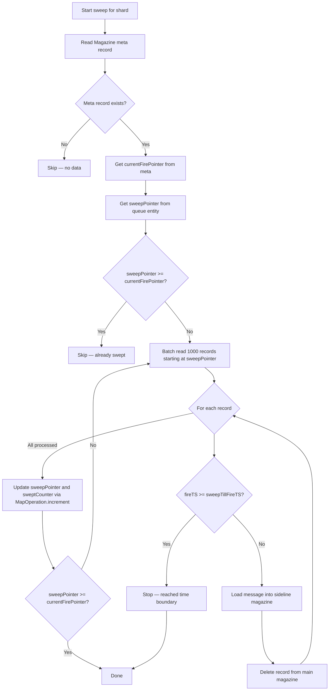

# Aerospike Backend

Comprehensive documentation of the Aerospike storage backend for IgnisMQ.

---

## Overview

IgnisMQ uses Aerospike as its primary storage backend, leveraging the [Magazine](https://github.com/PhonePe/Magazine) library for queue primitives (load/fire operations) and `AerospikeQueueService` for queue metadata management.

The storage layer is split into two concerns:

- **AerospikeStorage** — a thin configuration holder that carries the `AerospikeConfiguration` and namespace, implementing the `BaseStorage` visitor pattern.
- **AerospikeQueueService** — the actual CRUD and sweep logic for queue metadata, fire timestamps, and sweep operations.

---

## Configuration

```java
AerospikeStorage storage = new AerospikeStorage(
    AerospikeConfiguration.builder()
        .hosts(List.of(AerospikeHost.builder()
            .host("localhost")
            .port(3000)
            .build()))
        .retries(3)
        .sleepBetweenRetries(100)
        .socketTimeout(3000)
        .totalTimeout(5000)
        .maxConnectionsPerNode(100)
        .threadPoolSize(4)   // default: availableProcessors * 4
        .build(),
    "my-namespace"
);
```

!!! note "TLS"
    If credentials are configured in `AerospikeConfiguration`, the client will negotiate TLS automatically.

---

### Queue Metadata Set: `{farmId}_{clientId}_ignis_queues`

Each record represents one queue. The Aerospike key is the queue name.

| Bin | Type | Description |
|-----|------|-------------|
| `handlerType` | String | Message handler type identifier |
| `shards` | int | Number of shards for parallelism |
| `queueExpiry` | int | Queue expiry in seconds |
| `messageExpiry` | int | Message TTL in seconds |
| `concurrency` | int | Consumer concurrency |
| `shovelConcur` | int | Shovel concurrency |
| `shovelInterval` | int | Shovel time interval in seconds |
| `createdAt` | long | Creation timestamp (epoch ms) |
| `active` | String | `"true"` / `"false"` — used for secondary index |
| `sweepPointers` | Map&lt;String, Long&gt; | Per-shard sweep pointer positions |
| `sidelineSweep` | Map&lt;String, Long&gt; | Per-shard sideline sweep pointer positions |
| `sweptCounter` | long | Total messages swept from main magazine |
| `sidelineSwept` | long | Total messages swept from sideline magazine |
| `sweepDuration` | long | Sweep look-back duration in milliseconds |
| `maxBatchSize` | int | Batching config — max batch size (0 = disabled) |
| `maxWaitTime` | int | Batching config — max wait time in seconds (0 = disabled) |

### Magazine Data Sets (managed by Magazine library)

| Set Name Pattern | Purpose |
|------------------|---------|
| `{clientId}_data_set` | Message data records (keyed by `{queueName}_SHARD_{shard}_{pointer}`) |
| `{clientId}_meta_set` | Magazine pointers — load/fire pointers per shard |

!!! info "Sideline"
    Sideline queues reuse the same Magazine sets but with `_SIDELINE` appended to the queue name (e.g., `my-queue_SIDELINE`).

---

## Secondary Indexes

A secondary index is automatically created on the `active` bin (`IndexType.STRING`) during `AerospikeQueueService` construction:

```java
// Index name: {farmId}_{clientId}_ignis_queues_active
createIndex(setName + "_" + ACTIVE_BIN, ACTIVE_BIN, IndexType.STRING);
```

This enables efficient queries for active or inactive queues via `Filter.equal(ACTIVE_BIN, "true")`.

!!! warning
    If the index already exists (result code 200), creation is silently skipped.

---

## Client Configuration

The Aerospike client is configured in `AerospikeStoreClient` with the following policies:

| Setting | Value |
|---------|-------|
| Write commit level | `CommitLevel.COMMIT_ALL` |
| Write/read replica | `Replica.MASTER_PROLES` |
| Connection pool | `maxConnectionsPerNode` from config |
| Thread pool | `threadPoolSize` (default: `availableProcessors * 4`) |
| Write policy | `sendKey = true` (stores user key for retrieval) |
| TTL on write | Configurable per operation (`-2` = don't update TTL) |

### Retry Strategy

All `AerospikeQueueService` operations use a Guava `Retryer`:

```java
RetryerBuilder.newBuilder()
    .retryIfExceptionOfType(AerospikeException.class)
    .withStopStrategy(StopStrategies.stopAfterAttempt(configuration.getRetries()))
    .withWaitStrategy(WaitStrategies.fixedWait(
        configuration.getSleepBetweenRetries(), TimeUnit.MILLISECONDS))
    .withBlockStrategy(BlockStrategies.threadSleepStrategy())
    .build();
```

---

## Fire Timestamp Mechanism

When a consumer fires (dequeues) a message, `addFireTimestamp()` stamps the `fireTS` bin on the corresponding data record with the current epoch millisecond timestamp:

```java
queueService.addFireTimestamp(magazineData, System.currentTimeMillis());
```

This timestamp is later used by the sweeper to identify "stuck" messages — those that were fired but never acknowledged within the configured `sweepDuration`.

!!! note
    `fireTS` is also stamped during shoveling to reset the sweep clock for re-delivered messages.

---

## Sweep Internals

The sweep process detects messages that were fired but not consumed within the allowed time window and reloads them into the sideline magazine.

### Execution Flow

1. **Sweeper.run()** — Triggered as a `TimerTask` (only when this node is the active leader).
2. Fetches all active queues via `queueService.getQueues(true)`.
3. Submits each queue to a fixed thread pool (`Executors.newFixedThreadPool(64)`).
4. **Per queue**: iterates over each shard `0..numShards-1` sequentially.
5. **Per shard**: calls `queueService.sweep(queueName, shard, sweepTillFireTS, sidelineMagazine)`.

### Sweep Algorithm (per shard)



### Key Details

- **sweepTillFireTimestamp** = `System.currentTimeMillis() - sweepDuration`
- **Batch size**: 1000 records per batch (constant `SWEEP_BATCH_SIZE`)
- **Sideline sweep threshold**: `min(sweepTillFireTS, now - 2 * shovelTimeInterval)` — prevents sweeping messages that are about to be shoveled
- **Pointer updates**: Uses `MapOperation.increment` to atomically advance per-shard sweep pointers
- **Queue metadata TTL**: `queueExpiry * 2` (the `TTL_FACTOR_FOR_QUEUE_EXPIRY` constant)

---

## Performance Tips

| Lever | Guidance |
|-------|----------|
| **Shards** | More shards = more parallelism. Range: 1–512. Default: 32. |
| **Message TTL** | Set `messageExpiry` to keep data clean and prevent unbounded growth. |
| **Queue metadata TTL** | Automatically set to `queueExpiry * 2` for safety margin. |
| **Sweep batch size** | Fixed at 1000 — balances memory usage vs. scan efficiency. |
| **Namespace sizing** | Size the namespace memory for peak in-flight message volume. |
| **Thread pool** | Sweep parallelism is capped at 64 threads (`Constants.PARALLEL_FACTOR`). |
| **Concurrency** | Max 100 consumers per queue (`MAX_CONSUMERS_ALLOWED`). |
| **Connection pool** | Tune `maxConnectionsPerNode` based on cluster size and throughput. |
