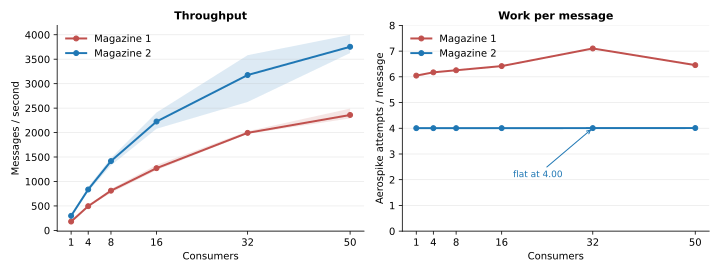
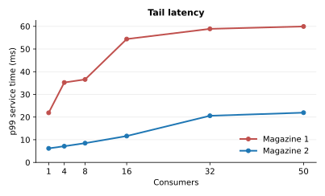
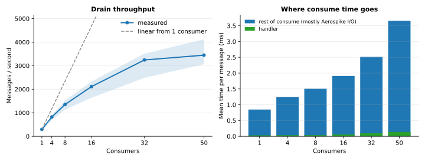
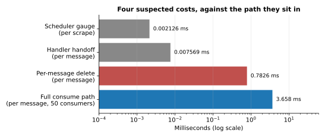
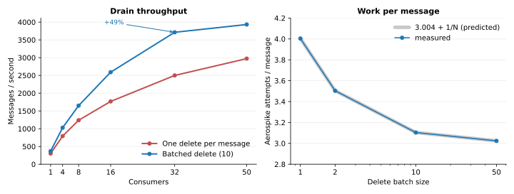

# Benchmark

Two measurements against the shipping 2.0 code: what the **Magazine 1 → 2 dependency change** does,
and **where time goes inside the consume path**.

| Question | Answer |
|---|---|
| Is the Magazine 2 bump worth taking? | **Yes.** +59% to +75% throughput at every consumer count, and work per message flat at 4.00 Aerospike calls where Magazine 1 rises to 7.1 |
| Does the handler handoff need removing? | **No.** 7.6 µs, flat to 50 consumers — about 0.2% of the message path |
| Does the overdue-task gauge need to be O(1)? | **No.** 2.1 µs at 50 tasks, scraped once per interval |
| Do idle consumers need a backoff? | **Not for storage cost.** Idle Aerospike traffic is already flat in consumer count |
| Is the per-message delete worth batching? | **Yes, and it shipped.** It was 24.75% of the per-message Aerospike work; batching it is worth **+22% to +49% throughput** at `batchSize=10` |
| Is the instrumentation worth removing? | **Not measurable.** Well inside fork-to-fork noise |

!!! warning "One laptop, one Aerospike container, a synthetic drain"
    These numbers describe **scaling shape and relative cost**, not production latency or capacity.
    The client JVM and the single-node container share ten cores, so absolute throughput is bounded
    by the machine.

---

## Method

Every point is **5 forked JVMs** at each of 1, 4, 8, 16, 32 and 50 consumers, 10,000 messages per
run, 32 shards, 256-byte payloads. Each run prefills the queue, then drains it; publishing is never
inside the measurement. Variant order alternates between forks, and all variants share one
container.

Two suites sit on the same harness:

- **Dependency comparison** — one worker per Magazine version. Reported as **means**.
- **Consume path** — ignisMQ's real `MagazineQueue` and `MagazineConsumerTask`. Reported as
  **medians with the min-max fork spread**.

They use different throughput definitions, so **a msg/s figure from one is not comparable with the
other**.

!!! note "The fire-timestamp difference is deliberate"
    ignisMQ 1.x wrote a per-message `fireTS` bin; 2.0 removed it in favour of a delivery-time
    watermark. The Magazine 1 worker writes it, the Magazine 2 worker does not. Both contain the
    identical code — it is a run-time flag.

    That asymmetry **is** the measurement: it compares the old deployed shape against the new one.
    It does mean the headline cannot be credited to Magazine alone, so it is separated out
    [below](#what-the-saving-is-made-of).

`attempts` counts **client-side calls** through a proxy on the Aerospike client interface. Retries
inside the driver are invisible to it, and a batch read counts as one attempt however many keys it
carries.

??? note "Environment"

    | | |
    |---|---|
    | Host | Apple M1 Pro, 10 cores, 16 GiB, arm64 |
    | OS | macOS 26.6.2 (25G83) |
    | Java | OpenJDK 17.0.14, worker JVMs at `-Xms512m -Xmx512m` |
    | Aerospike | `aerospike/aerospike-server:6.2.0.7`, one local container, `MEM_GB=1 STORAGE_GB=1` |
    | Docker | 26.1.3 |
    | ignisMQ | `2.0.0-SNAPSHOT` |
    | Magazine 2 | `magazine-core:2.0.0-SNAPSHOT`, commit `6a05f2c` |
    | Magazine 1 | `com.phonepe:magazine:v1.0.0-4` |

    Each version resolves its own transitive Aerospike driver — 6.1.7 and 6.3.1 — and Magazine 2's
    Micrometer instrumentation stays on. Both are part of the bump as an operator would take it.

---

## Magazine 1 → 2

| Consumers | v1 msg/s | v2 msg/s | Change | v1 attempts | v2 attempts |
|---:|---:|---:|---:|---:|---:|
| 1 | 180.39 | 297.66 | **+65.0%** | 6.047 | 4.004 |
| 4 | 495.25 | 836.20 | **+68.8%** | 6.174 | 4.004 |
| 8 | 811.65 | 1417.06 | **+74.6%** | 6.255 | 4.005 |
| 16 | 1271.97 | 2225.46 | **+75.0%** | 6.417 | 4.005 |
| 32 | 1994.05 | 3176.32 | **+59.3%** | 7.103 | 4.006 |
| 50 | 2359.62 | 3753.83 | **+59.1%** | 6.455 | 4.009 |

All 60 runs delivered 10,000 unique messages with zero duplicates and zero errors.

- **Throughput improves 59–75% everywhere**, and the gap widens rather than closes as consumers are
  added.
- **The durable result is the flat line on the right.** Magazine 2 holds at 4.00 Aerospike calls per
  message across a fifty-fold change in consumer count. Magazine 1 climbs to 7.1.
- **That rise is contention.** Magazine 1's read-then-increment fire path lets competing consumers
  act on a stale pointer read and retry a missing payload, so adding consumers adds wasted reads.
  Magazine 2's guarded increment claims only an available pointer.
- A throughput number is a property of this laptop. **An attempt count that does not move with
  consumer count is a property of the algorithm** — that is the part that transfers to production.

Tail latency falls by roughly a factor of three, and Magazine 1's p99 is already flattening near
60 ms by 16 consumers.

### What the saving is made of

The ~2.0 attempts saved per message is **not** all Magazine:

| Consumers | Total saving | `fireTS` write removed | Magazine `get` reduction |
|---:|---:|---:|---:|
| 1 | 2.043 | 1.000 | 1.046 |
| 16 | 2.412 | 1.000 | 1.417 |
| 32 | 3.096 | 1.000 | 2.102 |
| 50 | 2.446 | 1.000 | 1.454 |

The fire-timestamp column is exactly 1.000 everywhere — Magazine 1 records 10,000 `put` calls per
run, Magazine 2 records zero. It is one write per message, so removing it saves one attempt per
message however many consumers there are.

**Everything that grows with consumer count is Magazine's.** `delete` is exactly 1.000 in both, and
`operate` is 2.00 in both to within 0.01. The whole difference sits in `get`: Magazine 1 rises from
2.05 per message to a peak of 3.10 at 32 consumers, while Magazine 2 holds at 1.00.

So at one consumer the saving is half fire-timestamp and half Magazine — and **all** of the
additional saving as consumers scale is Magazine.

??? note "Raw forks — 60 runs"

    | Consumers | Variant | Fork | msg/s | attempts/msg | p50 ms | p95 ms | p99 ms |
    |---:|---|---:|---:|---:|---:|---:|---:|
    | 1 | `magazine-v1` | 1 | 175.92 | 6.048 | 4.965 | 7.115 | 24.794 |
    | 1 | `magazine-v1` | 2 | 188.67 | 6.039 | 4.720 | 6.199 | 18.845 |
    | 1 | `magazine-v1` | 3 | 179.68 | 6.053 | 4.839 | 6.507 | 19.384 |
    | 1 | `magazine-v1` | 4 | 179.82 | 6.051 | 4.854 | 6.840 | 18.922 |
    | 1 | `magazine-v1` | 5 | 177.88 | 6.044 | 4.855 | 6.967 | 27.427 |
    | 1 | `magazine-v2` | 1 | 297.44 | 4.004 | 3.251 | 4.386 | 5.469 |
    | 1 | `magazine-v2` | 2 | 296.33 | 4.004 | 3.284 | 4.407 | 5.373 |
    | 1 | `magazine-v2` | 3 | 305.12 | 4.004 | 3.208 | 4.283 | 5.262 |
    | 1 | `magazine-v2` | 4 | 306.77 | 4.004 | 3.162 | 4.169 | 5.460 |
    | 1 | `magazine-v2` | 5 | 282.65 | 4.004 | 3.249 | 5.124 | 9.370 |
    | 4 | `magazine-v1` | 1 | 491.14 | 6.176 | 7.232 | 9.447 | 35.283 |
    | 4 | `magazine-v1` | 2 | 492.39 | 6.199 | 7.021 | 9.254 | 33.860 |
    | 4 | `magazine-v1` | 3 | 487.18 | 6.195 | 7.026 | 10.657 | 33.233 |
    | 4 | `magazine-v1` | 4 | 508.59 | 6.090 | 6.827 | 8.706 | 31.701 |
    | 4 | `magazine-v1` | 5 | 496.94 | 6.210 | 6.798 | 9.476 | 42.101 |
    | 4 | `magazine-v2` | 1 | 796.66 | 4.004 | 4.903 | 6.549 | 7.887 |
    | 4 | `magazine-v2` | 2 | 802.63 | 4.004 | 4.908 | 6.330 | 7.347 |
    | 4 | `magazine-v2` | 3 | 845.17 | 4.004 | 4.668 | 5.989 | 6.844 |
    | 4 | `magazine-v2` | 4 | 847.72 | 4.004 | 4.651 | 5.940 | 6.895 |
    | 4 | `magazine-v2` | 5 | 888.82 | 4.004 | 4.426 | 5.736 | 6.767 |
    | 8 | `magazine-v1` | 1 | 801.12 | 6.238 | 8.639 | 12.285 | 35.167 |
    | 8 | `magazine-v1` | 2 | 799.53 | 6.252 | 8.522 | 11.389 | 34.686 |
    | 8 | `magazine-v1` | 3 | 842.94 | 6.281 | 8.083 | 10.226 | 23.822 |
    | 8 | `magazine-v1` | 4 | 767.49 | 6.245 | 8.458 | 16.747 | 55.393 |
    | 8 | `magazine-v1` | 5 | 847.18 | 6.260 | 8.298 | 11.156 | 33.830 |
    | 8 | `magazine-v2` | 1 | 1366.00 | 4.005 | 5.755 | 7.397 | 8.759 |
    | 8 | `magazine-v2` | 2 | 1328.12 | 4.005 | 5.882 | 7.844 | 9.767 |
    | 8 | `magazine-v2` | 3 | 1431.98 | 4.004 | 5.472 | 7.165 | 8.374 |
    | 8 | `magazine-v2` | 4 | 1479.25 | 4.004 | 5.326 | 6.777 | 7.606 |
    | 8 | `magazine-v2` | 5 | 1479.95 | 4.004 | 5.314 | 6.906 | 7.900 |
    | 16 | `magazine-v1` | 1 | 1232.80 | 6.409 | 10.557 | 14.356 | 47.649 |
    | 16 | `magazine-v1` | 2 | 1230.95 | 6.364 | 10.694 | 21.207 | 57.790 |
    | 16 | `magazine-v1` | 3 | 1260.02 | 6.455 | 9.976 | 19.645 | 67.123 |
    | 16 | `magazine-v1` | 4 | 1336.98 | 6.437 | 10.153 | 18.181 | 49.532 |
    | 16 | `magazine-v1` | 5 | 1299.08 | 6.422 | 10.378 | 19.950 | 49.866 |
    | 16 | `magazine-v2` | 1 | 2077.97 | 4.005 | 7.454 | 10.469 | 13.009 |
    | 16 | `magazine-v2` | 2 | 2164.89 | 4.005 | 7.189 | 9.957 | 12.843 |
    | 16 | `magazine-v2` | 3 | 2312.61 | 4.005 | 6.823 | 8.890 | 9.987 |
    | 16 | `magazine-v2` | 4 | 2161.82 | 4.005 | 7.174 | 10.062 | 12.775 |
    | 16 | `magazine-v2` | 5 | 2410.01 | 4.005 | 6.537 | 8.473 | 9.526 |
    | 32 | `magazine-v1` | 1 | 1989.83 | 7.325 | 14.023 | 23.443 | 52.551 |
    | 32 | `magazine-v1` | 2 | 1990.48 | 7.389 | 13.567 | 23.119 | 61.984 |
    | 32 | `magazine-v1` | 3 | 1973.35 | 7.275 | 14.830 | 24.697 | 45.886 |
    | 32 | `magazine-v1` | 4 | 1988.64 | 7.317 | 14.316 | 22.885 | 72.215 |
    | 32 | `magazine-v1` | 5 | 2027.93 | 6.208 | 13.268 | 23.544 | 61.785 |
    | 32 | `magazine-v2` | 1 | 2625.83 | 4.006 | 11.336 | 19.616 | 32.454 |
    | 32 | `magazine-v2` | 2 | 3345.00 | 4.007 | 9.186 | 13.827 | 19.861 |
    | 32 | `magazine-v2` | 3 | 3581.86 | 4.005 | 8.550 | 12.764 | 17.436 |
    | 32 | `magazine-v2` | 4 | 3121.52 | 4.006 | 10.003 | 14.215 | 18.776 |
    | 32 | `magazine-v2` | 5 | 3207.39 | 4.006 | 9.937 | 12.632 | 14.293 |
    | 50 | `magazine-v1` | 1 | 2289.94 | 6.395 | 20.277 | 27.805 | 59.912 |
    | 50 | `magazine-v1` | 2 | 2392.64 | 6.492 | 18.393 | 29.971 | 58.993 |
    | 50 | `magazine-v1` | 3 | 2490.72 | 6.526 | 18.559 | 29.396 | 61.761 |
    | 50 | `magazine-v1` | 4 | 2297.91 | 6.424 | 20.014 | 26.264 | 57.035 |
    | 50 | `magazine-v1` | 5 | 2326.89 | 6.439 | 19.223 | 32.766 | 61.991 |
    | 50 | `magazine-v2` | 1 | 3641.50 | 4.009 | 13.736 | 19.028 | 24.581 |
    | 50 | `magazine-v2` | 2 | 3810.94 | 4.008 | 13.031 | 17.618 | 22.708 |
    | 50 | `magazine-v2` | 3 | 3625.77 | 4.009 | 13.725 | 18.578 | 22.957 |
    | 50 | `magazine-v2` | 4 | 4000.14 | 4.009 | 12.376 | 16.539 | 18.801 |
    | 50 | `magazine-v2` | 5 | 3690.81 | 4.008 | 13.537 | 17.508 | 20.592 |

    At 32 consumers Magazine 1 fork 5 reports 6.208 attempts/msg against 7.28–7.39 for forks 1–4,
    and Magazine 2 fork 1 reports 2625.83 msg/s against 3121–3582 for the rest. The 32-consumer row
    is the least stable in the table; its +59.3% should not be read as a real dip.

---

## Inside the consume path

This half drives the real shipping classes — real metrics, real handler executor, real scheduler.

| Consumers | msg/s | consume mean | handler mean | attempts/delivery |
|---:|---:|---:|---:|---:|
| 1 | 292.8 [242.8–308.4] | 847.5 µs | 30.6 µs | 4.007 |
| 4 | 820.3 [687.2–893.3] | 1244.7 µs | 34.5 µs | 4.007 |
| 8 | 1351.3 [1132.8–1517.3] | 1506.3 µs | 36.2 µs | 4.008 |
| 16 | 2112.0 [1637.9–2328.0] | 1910.1 µs | 59.6 µs | 4.009 |
| 32 | 3243.0 [2483.9–3509.2] | 2515.0 µs | 96.8 µs | 4.011 |
| 50 | 3447.1 [3062.4–4123.1] | 3658.0 µs | 138.5 µs | 4.013 |

All 30 runs delivered 10,000 unique messages, with no sidelining, nothing unconsumed and no
saturation refusals.

- **Scaling is close to linear to 32 consumers, then flattens** — 32 → 50 buys about 6%. That knee
  is the ten-core host saturating, not the queue: attempts per delivery move only from 4.007 to
  4.013, so the extra consumers are waiting, not working harder.
- **The handler is a rounding error.** The green sliver in the right-hand chart is the handler; the
  rest is overwhelmingly Aerospike I/O. At 50 consumers the handler is 138 µs of a 3,658 µs path.

### The four suspected costs

Three of the four were suspected of justifying a redesign. The chart settles it — two sit three
orders of magnitude below the path they were supposed to be slowing.

| Candidate | Measured | Verdict |
|---|---|---|
| **Handler handoff** | 7.6 µs, flat 1→50 consumers. Inline call is 12 ns | **Keep.** ~0.2% of the message path. The executor's hard cap on concurrent handlers costs almost nothing |
| **Overdue-task gauge** | 702 ns at 1 task → 2,126 ns at 50. O(n) confirmed, ~30 ns/task | **Keep.** 2 µs per scrape, once per scrape interval |
| **Idle poll floor** | 0.93 empty polls/consumer/s — the 1-second period, confirmed | **Keep.** See below |
| **Per-message delete** | 782.6 µs against 2,379.4 µs for `fire` | **Changed, and measured.** Was 24.75% of the per-message Aerospike work; batching it gave +22% to +49% throughput |

### The delete is the one worth acting on

Driving Magazine directly, single-threaded, timing `fire()` and `delete()` around each other:

| | Median | Across 5 forks |
|---|---:|---|
| `fire` per message | 2379.4 µs | 2097.4 – 3158.4 |
| `delete` per message | 782.6 µs | 694.6 – 1024.2 |
| **delete share of `fire` + `delete`** | **24.75%** | **24.49 – 24.88** |

The share is stable to under half a percentage point across forks even though the absolute
microseconds move by 50% — the signature of a ratio between two costs that scale together.

!!! note "What the 24.75% is a share of"
    The `fire` + `delete` pair **only** — not the full consume path, which also contains
    deserialisation, the handler and scheduling. Read it as: *of the Aerospike work done per
    message, a quarter is the delete.*

Cross-checked by a second route: the drain scenario reports 4.007–4.013 attempts per delivery
through the real consumer, this one reports 4.004 driving Magazine directly. Two independent
instruments agreeing to within 0.01 attempts is the evidence that neither is miscounting.

A quarter of the storage cost of consuming a message is spent retiring it, one round trip at a time.
**The fix is a batched delete, and it has since been built and measured.** Magazine 2.0 exposes
`deleteAll(Collection<MagazineData<T>>)` — one round trip for the whole batch on the Aerospike
backend — and the consumer now retires an accepted batch through it instead of deleting message by
message. No delay is involved: the deletes were already issued back-to-back immediately after the
handler returned for the whole batch, so collapsing them into a single call removes round trips from
a burst that is already happening. The delete batch *is* the delivery batch; nothing accumulates
across deliveries.

### What batching the delete actually bought

Same instrument, same machine, re-run after the change. First, driving Magazine directly, varying
only how the fired records are retired:

| Retirement | Attempts/msg | `delete` µs/msg | delete share of `fire`+`delete` |
|---|---:|---:|---:|
| `delete` per message | 4.004 | 826.8 | **24.762%** |
| `deleteAll`, batch 2 | 3.504 | 543.2 | 17.253% |
| `deleteAll`, batch 10 | 3.104 | 125.9 | **4.638%** |
| `deleteAll`, batch 50 | 3.024 | 29.4 | 1.140% |

**The attempt counts land exactly where arithmetic says they must**: `3.004 + 1/N`, because `fire`
costs three calls and the batch adds one delete call per N messages. `fire` itself stays flat at
2,535–2,559 µs across all four, which is the control — only the retirement changed. At a batch of
10 the delete stops being a quarter of the storage path and becomes a twentieth.

!!! note "This also re-validates the original measurement"
    The `delete`-per-message row reproduces **24.762%** against the **24.75%** recorded before the
    change — an independent re-run agreeing to just over a hundredth of a percentage point.

Second, and the one that matters, through the **real** `MagazineQueue` + `MagazineConsumerTask`
drain — 10,000 messages, 5 forks, 32 shards, `batchSize=10` against no batching:

| Consumers | Unbatched msg/s | Batched msg/s | Throughput | Attempts/delivery |
|---:|---:|---:|---:|---|
| 1 | 302.2 | 368.7 | **+22.0%** | 4.007 → 3.107 |
| 4 | 792.6 | 1,029.4 | **+29.9%** | 4.008 → 3.108 |
| 8 | 1,238.5 | 1,649.5 | **+33.2%** | 4.008 → 3.109 |
| 16 | 1,768.2 | 2,591.2 | **+46.5%** | 4.008 → 3.110 |
| 32 | 2,499.6 | 3,713.9 | **+48.6%** | 4.011 → 3.113 |
| 50 | 2,972.9 | 3,933.3 | **+32.3%** | 4.013 → 3.116 |

**Between +22% and +49% more throughput, median +32.7%**, for a change that removes no work other
than round trips. Total Aerospike calls for a 10,000-message drain fall from ~40,083 to ~31,094, a
**22.4%** reduction, and every one of the 60 runs delivered all 10,000 messages exactly once with
nothing sidelined.

!!! warning "This pays only when batching is enabled"
    All of the above is at `batchSize=10`. **At the default of one message per delivery there is
    nothing to batch**: a one-record batch takes the single-key path by design, and the numbers in
    the sections above — which were measured non-batched — are unchanged by this work. The gain is
    available to queues that configure a `batchingConfig`, not to every queue automatically.

    Note also what the batched consume path trades: `consumeMeanMicros` roughly doubles, because one
    consume now covers ten messages. Per message it is far cheaper, which is what the throughput
    column reports.

### Idle consumers already cost nothing in storage

Over a 15-second window on a fully drained queue:

| Consumers | Empty polls | Per consumer per second | Client attempts | Batch keys |
|---:|---:|---:|---:|---:|
| 1 | 14 | 0.933 | 2 | 64 |
| 8 | 112 | 0.933 | 2 | 64 |
| 50 | 700 | 0.933 | 2 | 64 |

**The column that matters is client attempts, not polls.** Aerospike traffic holds at a median of
2 attempts covering 64 batch keys per 15 seconds whether there is one consumer or fifty. Fifty idle
consumers generate the same storage load as one.

!!! warning "This corrects a premise the project held for some time"
    An idle-backoff feature was scoped on the belief that idle consumers cost a constant CPU **and**
    Aerospike load. The Aerospike half is false. `ActiveShardSelector` caches shard state with
    `refreshAfterWrite`, and `suppress` prunes a shard the caller has just observed drained, so once
    every shard is pruned a drained queue answers from cache with no round trip. The only idle
    traffic is the periodic active-shard refresh, which is **per queue, not per consumer**.

    So an idle backoff would save timer wake-ups only, and would pay for them in wake-up latency.
    The lever that actually reduces idle storage traffic is the active-shard refresh interval.

### The instrumentation is not measurable

The same drain, same JAR, same container, differing only by a flag:

| Consumers | Metrics on | Metrics off | Difference |
|---:|---:|---:|---:|
| 1 | 287.2 | 285.3 | **+0.7%** |
| 16 | 2033.2 | 2044.3 | **−0.5%** |
| 50 | 3698.7 | 3692.7 | **+0.2%** |

A positive figure means the **instrumented** build measured faster — which it did at two of the
three counts. At 50 consumers the fork-to-fork spread runs 3,112 to 4,211 msg/s, about 30% of the
median, against a 0.2% difference under test.

The honest conclusion is not "metrics are cheap" but **"this experiment cannot measure them"**.

??? note "Raw forks — consume path"

    **Drain** — 30 runs

    | Consumers | Fork | msg/s | consume µs | handler µs | attempts/delivery | empty polls |
    |---:|---:|---:|---:|---:|---:|---:|
    | 1 | 1 | 297.9 | 829.0 | 28.820 | 4.0073 | 0 |
    | 1 | 2 | 308.4 | 799.0 | 25.685 | 4.0105 | 0 |
    | 1 | 3 | 292.8 | 847.5 | 30.646 | 4.0073 | 0 |
    | 1 | 4 | 242.8 | 1035.6 | 41.607 | 4.0073 | 0 |
    | 1 | 5 | 282.9 | 877.6 | 32.070 | 4.0105 | 0 |
    | 4 | 1 | 869.5 | 1177.7 | 29.773 | 4.0073 | 3 |
    | 4 | 2 | 820.3 | 1244.7 | 34.544 | 4.0073 | 2 |
    | 4 | 3 | 771.9 | 1320.7 | 37.281 | 4.0072 | 3 |
    | 4 | 4 | 687.2 | 1485.5 | 45.493 | 4.0078 | 3 |
    | 4 | 5 | 893.3 | 1142.5 | 25.908 | 4.0073 | 2 |
    | 8 | 1 | 1393.1 | 1451.7 | 35.950 | 4.0077 | 7 |
    | 8 | 2 | 1351.3 | 1506.3 | 36.220 | 4.0075 | 7 |
    | 8 | 3 | 1243.9 | 1627.5 | 44.921 | 4.0081 | 6 |
    | 8 | 4 | 1132.8 | 1798.2 | 57.278 | 4.0079 | 5 |
    | 8 | 5 | 1517.3 | 1336.4 | 29.924 | 4.0075 | 7 |
    | 16 | 1 | 2135.4 | 1902.7 | 59.601 | 4.0097 | 16 |
    | 16 | 2 | 2112.0 | 1910.1 | 53.469 | 4.0088 | 13 |
    | 16 | 3 | 1806.6 | 2225.9 | 78.910 | 4.0087 | 14 |
    | 16 | 4 | 1637.9 | 2468.2 | 97.847 | 4.0087 | 9 |
    | 16 | 5 | 2328.0 | 1735.8 | 44.895 | 4.0082 | 13 |
    | 32 | 1 | 3243.0 | 2515.0 | 96.831 | 4.0098 | 27 |
    | 32 | 2 | 3258.5 | 2486.6 | 81.680 | 4.0108 | 31 |
    | 32 | 3 | 2518.0 | 3284.0 | 183.1 | 4.0117 | 32 |
    | 32 | 4 | 2483.9 | 3292.1 | 172.6 | 4.0106 | 32 |
    | 32 | 5 | 3509.2 | 2282.4 | 66.513 | 4.0109 | 31 |
    | 50 | 1 | 3702.4 | 3404.4 | 138.5 | 4.0108 | 50 |
    | 50 | 2 | 3447.1 | 3658.0 | 129.8 | 4.0133 | 50 |
    | 50 | 3 | 3062.4 | 4231.8 | 271.3 | 4.0125 | 50 |
    | 50 | 4 | 3090.6 | 4191.9 | 285.5 | 4.0124 | 47 |
    | 50 | 5 | 4123.1 | 3025.8 | 130.0 | 4.0131 | 50 |

    Empty polls run at roughly one per consumer less one — the end of the drain, where every
    consumer except the one taking the last message wakes once and finds nothing. It does not grow
    with the length of the run.

    **Delete cost** — 5 runs, single-threaded

    | Fork | fire µs/msg | delete µs/msg | delete share % | attempts/msg |
    |---:|---:|---:|---:|---:|
    | 1 | 2370.2 | 779.8 | 24.756 | 4.0036 |
    | 2 | 2379.4 | 782.6 | 24.749 | 4.0037 |
    | 3 | 3158.4 | 1024.2 | 24.486 | 4.0039 |
    | 4 | 2973.4 | 964.7 | 24.496 | 4.0038 |
    | 5 | 2097.4 | 694.6 | 24.878 | 4.0036 |

    **Handler handoff** — median [min–max] ns per call

    | Consumers | Handoff | Inline |
    |---:|---:|---:|
    | 1 | 7023.7 [6296.9–7941.4] | 11.891 |
    | 4 | 7294.6 [6971.3–9251.4] | 12.432 |
    | 8 | 7672.6 [7146.2–9081.3] | 13.459 |
    | 16 | 7603.0 [7161.0–9567.8] | 12.580 |
    | 32 | 7440.7 [7003.2–10396.1] | 12.052 |
    | 50 | 7569.4 [6735.8–9112.3] | 12.235 |

    **Scheduler gauge** — median [min–max] ns per scrape

    | Tasks | ns/scrape | ns/task/scrape |
    |---:|---:|---:|
    | 1 | 702.3 [671.7–741.9] | 702.3 |
    | 4 | 859.6 [842.1–908.3] | 214.9 |
    | 8 | 1071.9 [739.6–1116.7] | 134.0 |
    | 16 | 1475.2 [1268.2–1786.9] | 92.199 |
    | 32 | 1665.7 [1111.7–1814.1] | 52.052 |
    | 50 | 2125.8 [1794.7–2817.2] | 42.516 |

    **Idle poll** — 15-second window, all six consumer counts

    | Consumers | Empty polls | Per consumer per second | Client attempts | Batch keys |
    |---:|---:|---:|---:|---:|
    | 1 | 14 | 0.933 | 2 | 64 |
    | 4 | 56 | 0.933 | 2 | 64 |
    | 8 | 112 | 0.933 | 2 | 64 |
    | 16 | 224 | 0.933 | 2 | 64 |
    | 32 | 448 | 0.933 | 2 | 64 |
    | 50 | 700 | 0.933 | 2 | 64 |

    Three of the thirty runs recorded 34 attempts rather than 2, and 34 − 2 = 32, one read per
    shard — a refresh landing inside the window. They occur at 4 and 16 consumers, not
    preferentially at 50.

    **Metrics on vs off** — msg/s per fork

    | Consumers | on | off |
    |---:|---|---|
    | 1 | 287.2, 262.8, 294.8, 282.1, 298.7 | 272.7, 285.3, 287.4, 294.8, 278.3 |
    | 16 | 2109.0, 1998.4, 2035.4, 2033.2, 2018.4 | 1968.8, 2011.9, 2076.7, 2073.3, 2044.3 |
    | 50 | 3391.7, 4210.9, 3850.3, 3390.7, 3698.7 | 3338.1, 3930.9, 3692.7, 3112.6, 4131.4 |

---

## Limitations

- **One machine, one container.** No network between client and server, no replication, no
  multi-node coordination.
- **Absolute throughput is host-bound.** The flattening beyond 32 consumers is the laptop
  saturating. The shape is meaningful; the ceiling is an artefact.
- **`attempts` counts client calls, not server round trips.** Driver-internal retries are invisible,
  and a batch read counts as one however many keys it carries.
- **The two suites are not comparable to each other** — different throughput windows, different
  aggregations.
- **The Magazine comparison bundles three changes**: the Magazine version, the fire-timestamp
  removal and each version's Aerospike driver. The first two are separated above; the driver is not.
- **Five forks bound dispersion, they do not establish significance.** Where the spread is wide — the
  32-consumer rows especially — read the brackets, not the median.
