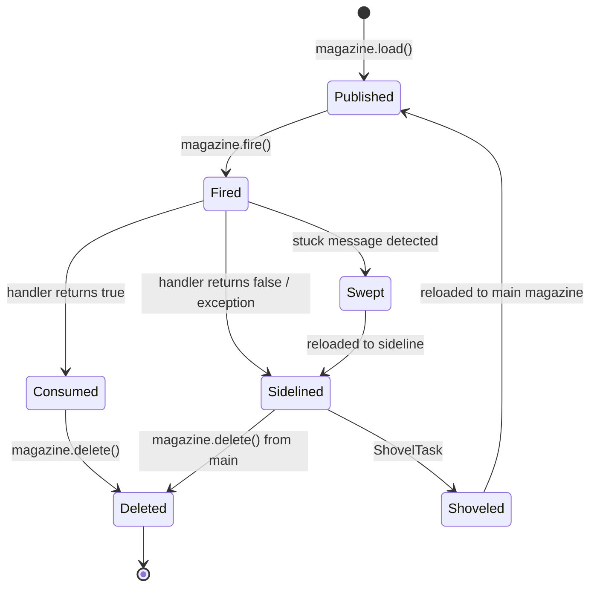
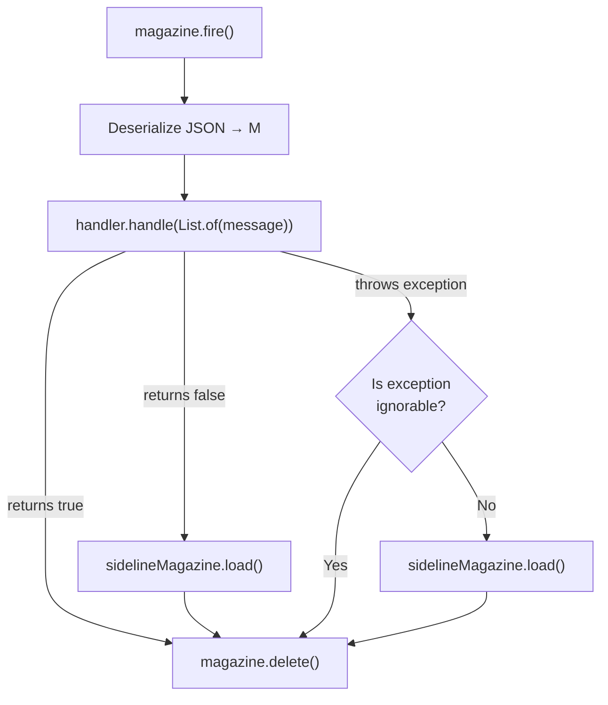
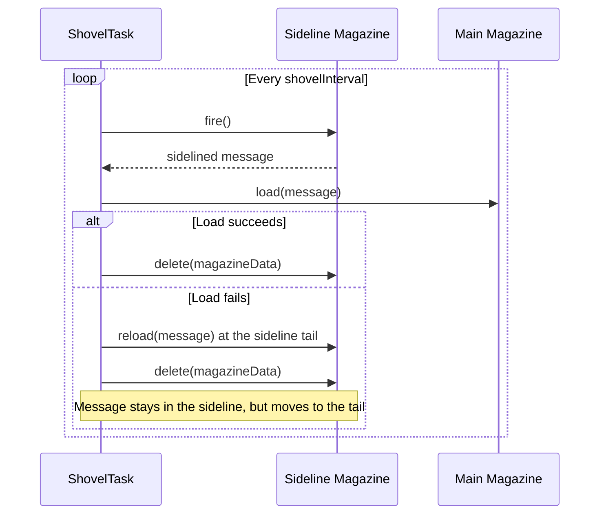
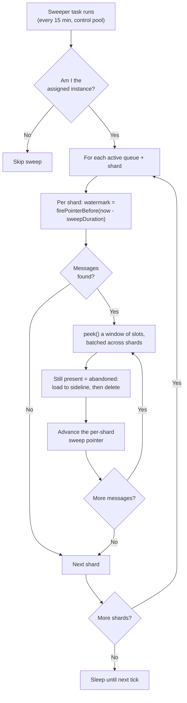
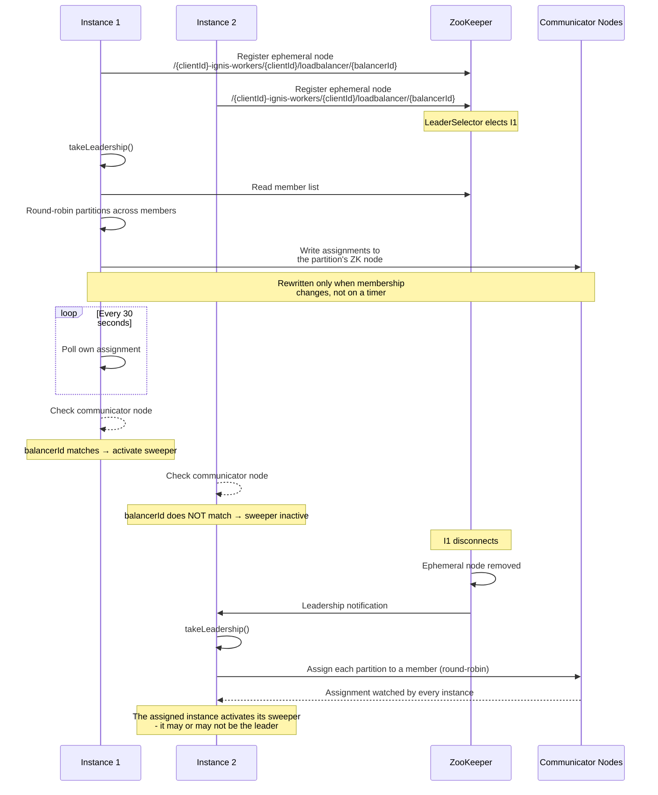
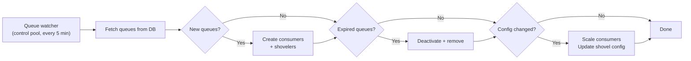

# Core Concepts

This page covers the internal architecture and key mechanisms of IgnisMQ. Understanding these concepts is essential for operating IgnisMQ effectively in production.

---

## Message Lifecycle

Every message in IgnisMQ follows a deterministic path from publication to deletion. The core abstraction is the **Magazine** — a sharded, persistent message store backed by your chosen datastore (Aerospike, etc.).



### Step-by-step

1. **Publish** — `queue.publish(message)` serializes the message to JSON and appends it to a shard at
   the load pointer.
2. **Fire** — a consumer claims the next slot by advancing that shard's fire pointer and reading it.
   The message is now in flight, and no other consumer will see it.
3. **Consume** — your `MessageHandler` processes it, on the handler pool, under a timeout.
4. **Delete, or sideline then delete** — on success the record is deleted. On failure it is copied to
   the sideline magazine **first**, and only deleted once the sideline has accepted it.

```java
// Publishing. This is the only one of the four you call yourself.
IQueue<MyEvent> queue = manager.getQueue("orders");
queue.publish(new MyEvent("order-123", "PLACED"));
```

!!! danger "Changed in 2.0: the delete is conditional"
    Earlier versions deleted the source record **regardless** of whether the transfer to the sideline
    had succeeded, so a failing sideline destroyed the only copy. The record is now left in place when
    the transfer fails; it sits below the fire pointer, where the sweeper will find it and retry. The
    same correction applies to the shovel and the sweeper.

!!!note
    All messages are serialized to JSON using Jackson's `ObjectMapper`. Ensure your message classes are serialization-friendly — include a no-arg constructor and avoid circular references.

---

## Sidelining

Sidelining is IgnisMQ's mechanism for isolating messages that could not be processed successfully. Rather than retrying in-place (which risks head-of-line blocking), failed messages are moved to a dedicated **sideline magazine** named `{queueName}_SIDELINE`.



### Decision logic in `MagazineConsumerTask`

| Outcome | Action |
|---|---|
| `handler.handle()` returns `true` | Message deleted from main magazine. Done. |
| `handler.handle()` returns `false` | Message loaded into sideline magazine, then deleted from main. |
| Exception thrown, **not** in `getIgnorableExceptions()` | Message loaded into sideline magazine, then deleted from main. |
| Exception thrown, **is** in `getIgnorableExceptions()` | Message deleted from main magazine. Not sidelined, not retried. |

!!!warning
    A message is deleted from the main magazine once it has been **accounted for** — either consumed successfully, or accepted by the sideline magazine, or recognised as an ignorable exception. It is **not** deleted when the sideline transfer itself fails: the record is left in place for the sweeper, because deleting it would destroy the only remaining copy. See the 2.0 note above. If you need to inspect failures, look in the sideline magazine.

!!!tip
    Use `getIgnorableExceptions()` to list exception types that represent permanent, non-recoverable failures (e.g., `IllegalArgumentException`, `ValidationException`). These messages are silently dropped since sidelining and shoveling them would be pointless.

```java
public class OrderHandler implements MessageHandler<OrderEvent> {

    @Override
    public boolean handle(OrderEvent message) {
        // return true  → message consumed successfully
        // return false → message sidelined for later retry
        return orderService.process(message);
    }

    @Override
    public boolean handle(List<OrderEvent> messages) {
        // This is the one ignisMQ actually calls, in every mode. A non-batching
        // queue calls it with a single-element list.
        return orderService.processAll(messages);
    }

    @Override
    public Set<Class<?>> getIgnorableExceptions() {
        // These exceptions cause the message to be deleted, not sidelined
        return Set.of(
            IllegalArgumentException.class,
            MalformedOrderException.class
        );
    }
}
```

!!! danger "Only `handle(List<M>)` is ever called"
    `MessageHandler` declares both `handle(M)` and `handle(List<M>)` and you must implement both to
    compile, but **ignisMQ only ever calls the `List` overload** — including on queues with no
    `batchingConfig`, which call it with a one-element list. `handle(M)` is dead from ignisMQ's
    point of view.

    Put your logic in `handle(List<M>)`. A handler that implements only `handle(M)` and leaves the
    list overload throwing or returning `false` will sideline every message it receives.

    Note also that `getIgnorableExceptions` returns `Set<Class<?>>`, not
    `Set<Class<? extends Exception>>`.

---

## Shoveling

The **ShovelTask** moves messages from the sideline magazine back into the main magazine for reprocessing. This is the retry mechanism in IgnisMQ.



### Two modes of operation

**Scheduled mode** (default)

- Runs on a periodic timer controlled by `ShovelConfig.timeIntervalInSecs`.
- Default interval: **600 seconds (10 minutes)**.
- Keeps running indefinitely.

**One-shot mode** (`autoDelete=true`)

- Executes a single shovel pass and then simply does not repeat; nothing is cancelled. Its future stays in the queue's shovel list, so it keeps counting against the shovel cap for the life of the queue.
- If an error occurs during the pass, it self-reschedules with a **10-second delay** before retrying.
- Useful for on-demand sideline draining.

### Configuration

```java
ShovelConfig config = ShovelConfig.builder()
    .concurrency(4)            // default: 4 parallel shovel workers
    .timeIntervalInSecs(600)   // default: 600 (10 minutes)
    .build();
```

| Parameter | Default | Description |
|---|---|---|
| `concurrency` | 4 | Number of parallel shovel workers per queue |
| `timeIntervalInSecs` | 600 | Interval between scheduled shovel passes |

!!!info
    A shoveled message is loaded into the main magazine at the tail, so it is delivered again in
    pointer order like any other message. Nothing is stamped on it — the sweeper works from shard
    watermarks, not per-message timestamps.

!!!warning
    If `magazine.load()` back to main fails, ignisMQ reloads the message at the sideline tail. If
    *that* also fails, the record is left where it is rather than deleted - it sits below the
    sideline fire pointer, which is exactly where the sideline sweep looks, and the transfer is
    retried from there. Delivery is at-least-once, so the cost of these retries is duplicates, not
    loss: handlers must be idempotent.

---

## Sweeping

The **Sweeper** is a safety net that catches messages stuck in the "fired but never consumed" state — typically due to consumer crashes, network partitions, or long GC pauses.



### Key parameters

| Parameter | Default | Description |
|---|---|---|
| Sweep interval | 15 minutes | How often the sweeper runs, on the control pool |
| Initial delay | 10 minutes | Delay before first sweep after startup |
| `sweepDurationInMins` | 20 | Messages claimed more than this many minutes ago are considered abandoned. Range 5–300 |
| Batch size | 1000 | Slots examined per batch |

### Sideline sweep logic

When sweeping the sideline magazine, the sweeper uses a more conservative threshold:

```
sweepThreshold = min(sweepTillFireTS, now - 2 * shovelInterval)
```

This prevents the sweeper from re-sidelining messages that are currently being shoveled back to the main queue. The `2x` multiplier provides a safety margin.

!!!warning
    The sweeper runs on **exactly one instance, which is not necessarily the leader**. The leader's
    job is to *assign* the sweep partition to some member — itself or another — by round-robin; the
    instance whose `balancerId` matches the assignment is the one that activates its sweeper. If
    leader election is misconfigured or ZooKeeper is down, no assignment happens and no sweeping
    occurs. Monitor your sideline queue depths to detect this.

!!!note
    Sweep pointers are tracked per-queue-per-shard in the queue entity using `MapOperation.put`, and the value written is **absolute** — the next slot to examine — rather than a delta. That is deliberate: a retried or overlapping pass converges on the same pointer instead of compounding, which an increment would not. Sweeps resume where they left off rather than re-scanning the shard.

---

## Leader Election

IgnisMQ uses **Apache Curator's `LeaderSelector`** backed by ZooKeeper to ensure that cluster-wide singleton tasks (like sweeping) run on exactly one instance.



### ZooKeeper path structure

```
/{clientId}-ignis-workers/
  └── {clientId}/
      ├── loadbalancer-leader    ← LeaderSelector election node
      ├── loadbalancer/
      │   ├── {balancerId}       ← ephemeral member node, one per instance
      │   └── {balancerId}
      └── readers/
          └── 1                  ← the sweep partition's assignment.
                                   One node: the sweeper is the only
                                   load-balanced worker today.
```

### How activation works

1. The leader reads all registered member nodes under `loadbalancer/`.
2. It round-robins partitions across members.
3. It writes each assignment (including a `balancerId`) to that **partition's** node under `readers/`. The nodes are keyed by partition, not by instance. There is exactly one partition today, `readers/1`, because the sweeper is the only load-balanced worker.
4. Each instance **polls** those nodes every 30 seconds — they are read, not watched. If the `balancerId` in the assignment matches the instance's own ID, it sets the `active` AtomicBoolean to `true`, enabling the sweeper. Activation can therefore lag a reassignment by up to 30 seconds.
5. Only **one** instance has `active = true` at any time.

!!!info
    Leadership state is refreshed every **30 seconds**. On ZK disconnect, leadership is immediately relinquished, triggering a re-election. The new leader reassigns partitions and a different instance may become the active sweeper.

---

## Queue Refresh Cycle

IgnisMQ keeps its in-memory queue state synchronized with the database through a background watcher.

| Parameter | Value |
|---|---|
| Refresh interval | 5 minutes |
| Initial delay | 1 minute |

### What `refreshQueues()` does

1. **Discovery** — Queries the datastore for all queue definitions. Any queue found in the DB but not in memory is created (consumers are started, shovel tasks are scheduled).
2. **Expiration** — Queues past their expiry time are deactivated.
3. **Cleanup** — Inactive queues are removed from in-memory data structures and their consumers/shovelers are cancelled.
4. **Reconciliation** — If a queue's `concurrency` or `ShovelConfig` has changed in the DB, the in-memory configuration is updated. Consumers are scaled up or down to match.



!!!tip
    You don't need to restart instances to pick up new queues or configuration changes. The refresh cycle handles this automatically within 5 minutes. For immediate effect, you can trigger a manual refresh if the client exposes that API.

---

## Threading and Isolation Model

!!! warning "Changed in 2.0"
    Consumers used to be `java.util.Timer` threads — one per consumer, one per shovel, plus one each
    for the watcher and the sweeper. A queue with 16 consumers burned ~18 threads on scheduling alone.
    They are now **tasks on shared pools**, and `concurrency` is a target share rather than a private
    thread.

A manager owns three pools:

| Pool | Threads | Runs | Why separate |
|---|---|---|---|
| **Control** | Fixed at 2 | Queue watcher, sweeper | This is the control plane. The watcher is how a queue created elsewhere becomes consumable here; the sweeper is the only thing that rescues messages from a dead consumer. Neither may be starved by the data plane it supervises |
| **Worker** | Grows to `workerThreads` (default 256) | Consumers and shovels | Shovels sit here deliberately: they are per-queue, configurable and do storage I/O — the same class of work as a consumer |
| **Handler** | Up to `workerThreads` | Your `MessageHandler` code, and nothing else | The only way to bound how long a worker waits for arbitrary user code is to not run it on that thread |

### What bounds each thread

Three mechanisms, each closing a different hole:

- **The consumer run budget** (30 s). A consumer drains until the queue is empty *or* the budget
  expires, then hands its thread back and resumes on the next scheduled run. Without it, one
  backlogged queue would hold a worker thread indefinitely. A batch already in hand is always
  finished rather than abandoned, so the budget never costs a delivery.
- **The handler timeout** (`handlerTimeoutInMins`, default 10, max 30). The handler runs on the
  handler pool and the worker stops waiting when the timeout expires. It is clamped to **at most half
  of `sweepDuration`**, so a handler cannot still be running when the sweeper re-homes the record it
  is working on. On timeout the message is sidelined under `reason=timeout`.
- **Handler-pool saturation.** If no handler thread becomes available within a 1 s grace period, the
  batch is **refused and sidelined** under `reason=saturated` rather than being run inline. A process
  leaking handler threads therefore sheds work visibly instead of quietly losing the bound.

!!! note "`concurrency` is a target, not a guarantee"
    Under the old `Timer` model, `concurrency: 4` meant four threads. It now means four scheduled
    consumer tasks competing for the shared worker pool. Size `workerThreads` as *concurrently active
    queues x their concurrency*, not as total configured consumers.

### Scheduling parameters

| Parameter | Value |
|---|---|
| Initial delay before the first poll | 1 second |
| Fixed delay between runs | 1 second |
| Consumer run budget | 30 seconds |
| Handler timeout | `handlerTimeoutInMins`, default 10 min, clamped to half of `sweepDuration` |
| Handler saturation grace | 1 second |
| Max consumers per queue | 99 attainable; `MAX_CONSUMERS_ALLOWED` is 100 and the check is exclusive |
| Shutdown grace | 10 seconds |

Fixed **delay**, not fixed rate: the 1 second gap is measured after the task finishes, so a slow
consumer never has runs queued up behind it.

### Scaling consumers at runtime

```java
manager.increaseConsumers("orders", 5);
manager.decreaseConsumers("orders", 3);
```

Scaling down goes through the scheduler rather than cancelling the future directly, so the pool is
resized too — otherwise scaling a queue down and up repeatedly would ratchet the thread count up for
demand that no longer exists.

!!! warning
    `MAX_CONSUMERS_ALLOWED` is 100, but the guard rejects a request that would *reach* it, so **99 is
    the highest attainable count**. `createQueue` and `increaseConsumers` raise
    `MAX_ALLOWED_CONSUMERS_EXCEEDED` rather than capping silently — and note that `concurrency: 100`
    passes request validation, which permits 100, and then fails at queue creation.

!!!tip
    For high-throughput queues, raise the consumer count rather than trying to speed up an individual
    consumer: each one processes its batch sequentially, so parallelism comes from having several on
    the same queue. Raise `workerThreads` with it — consumers are tasks competing for that pool, and
    adding consumers without adding capacity just lengthens the queue for a thread.
