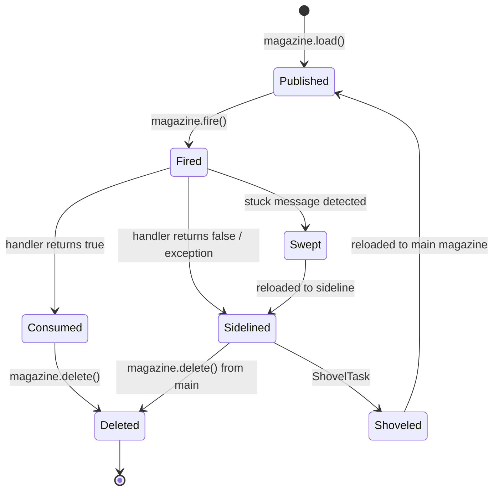
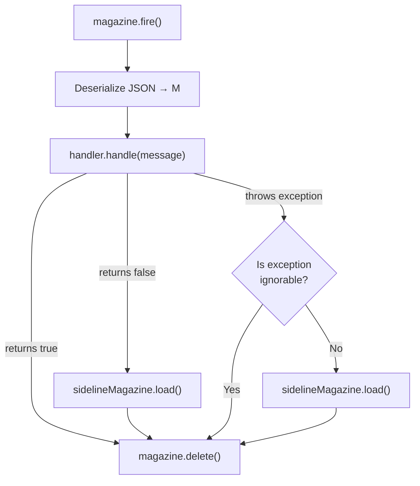
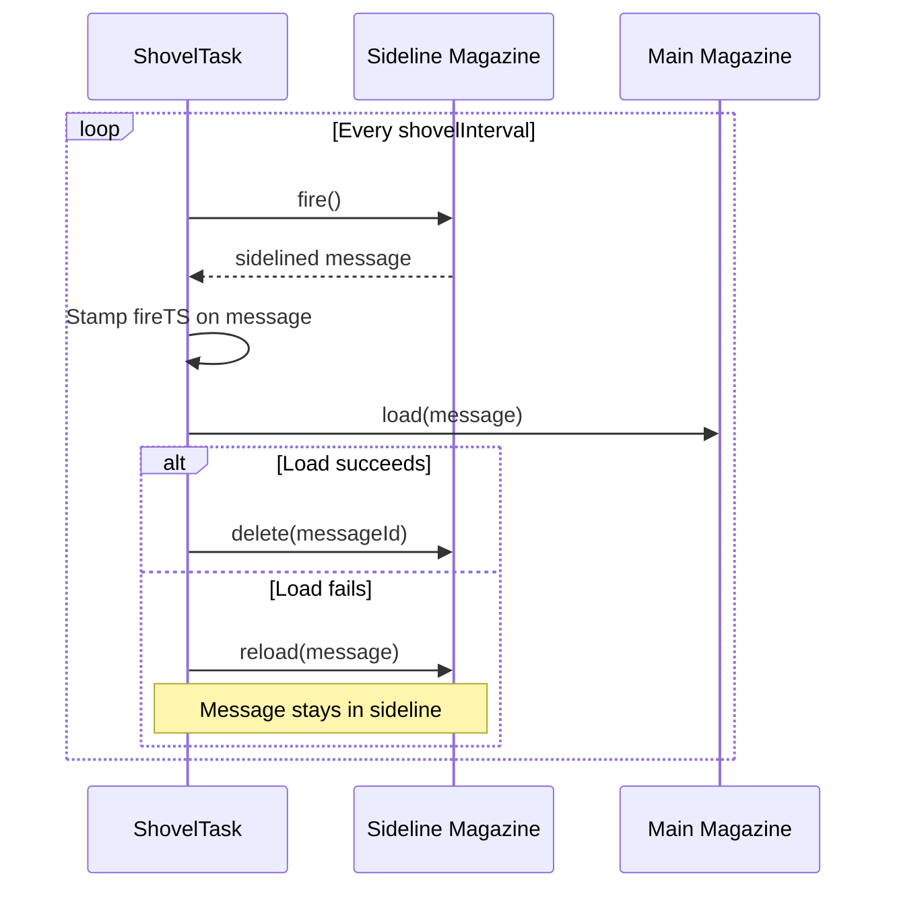
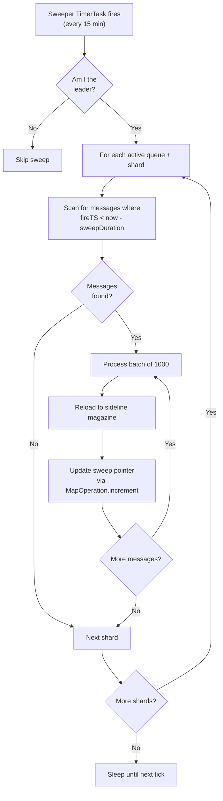
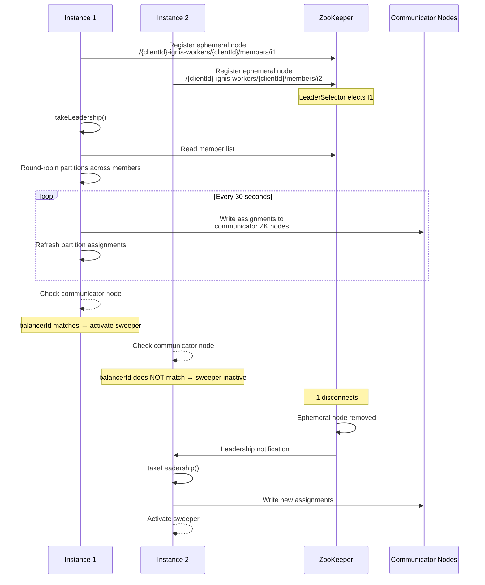
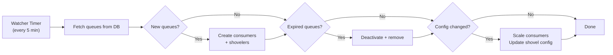

# Core Concepts

This page covers the internal architecture and key mechanisms of IgnisMQ. Understanding these concepts is essential for operating IgnisMQ effectively in production.

---

## Message Lifecycle

Every message in IgnisMQ follows a deterministic path from publication to deletion. The core abstraction is the **Magazine** — a sharded, persistent message store backed by your chosen datastore (Aerospike, etc.).



### Step-by-step

1. **Publish** — `magazine.load(message)` serializes the message to JSON via `ObjectMapper` and persists it to the datastore with a unique message ID and the current timestamp.
2. **Fire** — `magazine.fire()` retrieves the next available message from the store. The message is now considered "in-flight."
3. **Consume** — The registered `MagazineHandler` processes the message. The outcome determines what happens next (see [Sidelining](#sidelining)).
4. **Delete** — `magazine.delete(messageId)` removes the message from the main magazine. This happens **regardless** of whether the handler succeeded or failed.

```java
// Publishing a message
Magazine<MyEvent> magazine = ignisClient.getMagazine("orders", MyEvent.class);
magazine.load(new MyEvent("order-123", "PLACED"));

// Firing (typically done by the consumer loop, not user code)
MagazineEntry entry = magazine.fire();

// Deleting after processing
magazine.delete(entry.getMessageId());
```

!!!note
    All messages are serialized to JSON using Jackson's `ObjectMapper`. Ensure your message classes are serialization-friendly — include a no-arg constructor and avoid circular references.

---

## Sidelining

Sidelining is IgnisMQ's mechanism for isolating messages that could not be processed successfully. Rather than retrying in-place (which risks head-of-line blocking), failed messages are moved to a dedicated **sideline magazine** named `{queueName}_SIDELINE`.



### Decision logic in `MagazineConsumerTask`

| Outcome | Action |
|---|---|
| `handler.handle()` returns `true` | Message deleted from main magazine. Done. |
| `handler.handle()` returns `false` | Message loaded into sideline magazine, then deleted from main. |
| Exception thrown, **not** in `getIgnorableExceptions()` | Message loaded into sideline magazine, then deleted from main. |
| Exception thrown, **is** in `getIgnorableExceptions()` | Message deleted from main magazine. Not sidelined, not retried. |

!!!warning
    The message is **always** deleted from the main magazine after processing, regardless of success or failure. This is by design — it prevents poison messages from blocking the queue. If you need to inspect failures, look in the sideline magazine.

!!!tip
    Use `getIgnorableExceptions()` to list exception types that represent permanent, non-recoverable failures (e.g., `IllegalArgumentException`, `ValidationException`). These messages are silently dropped since sidelining and shoveling them would be pointless.

```java
public class OrderHandler implements MagazineHandler<OrderEvent> {

    @Override
    public boolean handle(OrderEvent message) {
        // return true  → message consumed successfully
        // return false → message sidelined for later retry
        return orderService.process(message);
    }

    @Override
    public Set<Class<? extends Exception>> getIgnorableExceptions() {
        // These exceptions cause the message to be deleted, not sidelined
        return Set.of(
            IllegalArgumentException.class,
            MalformedOrderException.class
        );
    }
}
```

---

## Shoveling

The **ShovelTask** moves messages from the sideline magazine back into the main magazine for reprocessing. This is the retry mechanism in IgnisMQ.



### Two modes of operation

**Scheduled mode** (default)

- Runs on a periodic timer controlled by `ShovelConfig.timeIntervalInSecs`.
- Default interval: **600 seconds (10 minutes)**.
- Keeps running indefinitely.

**One-shot mode** (`autoDelete=true`)

- Executes a single shovel pass, then cancels itself.
- If an error occurs during the pass, it self-reschedules with a **10-second delay** before retrying.
- Useful for on-demand sideline draining.

### Configuration

```java
ShovelConfig config = ShovelConfig.builder()
    .concurrency(4)            // default: 4 parallel shovel workers
    .timeIntervalInSecs(600)   // default: 600 (10 minutes)
    .build();
```

| Parameter | Default | Description |
|---|---|---|
| `concurrency` | 4 | Number of parallel shovel workers per queue |
| `timeIntervalInSecs` | 600 | Interval between scheduled shovel passes |

!!!info
    Each shoveled message gets a fresh `fireTS` stamped on it. This timestamp is critical for sweep tracking — it allows the sweeper to distinguish between newly shoveled messages and genuinely stuck ones.

!!!warning
    If `magazine.load()` back to main fails, ignisMQ attempts to reload the message to the sideline.
    Magazine delivery is at-most-once, so an ambiguous timeout or a failed reload can still lose a
    message. Handlers that require stronger guarantees must persist their own idempotency state.

---

## Sweeping

The **Sweeper** is a safety net that catches messages stuck in the "fired but never consumed" state — typically due to consumer crashes, network partitions, or long GC pauses.



### Key parameters

| Parameter | Default | Description |
|---|---|---|
| Sweep interval | 15 minutes | How often the sweeper runs |
| Initial delay | 10 minutes | Delay before first sweep after startup |
| `sweepDurationInMins` | 20 | Messages fired more than this many minutes ago are considered stuck |
| Batch size | 1000 | Messages processed per batch |

### Sideline sweep logic

When sweeping the sideline magazine, the sweeper uses a more conservative threshold:

```
sweepThreshold = min(sweepTillFireTS, now - 2 * shovelInterval)
```

This prevents the sweeper from re-sidelining messages that are currently being shoveled back to the main queue. The `2x` multiplier provides a safety margin.

!!!warning
    The sweeper only runs on the **leader-elected instance**. If leader election is misconfigured or ZooKeeper is down, no sweeping occurs. Monitor your sideline queue depths to detect this.

!!!note
    Sweep pointers are tracked per-queue-per-shard in the queue entity using `MapOperation.increment`. This allows sweeps to resume from where they left off rather than re-scanning the entire shard.

---

## Leader Election

IgnisMQ uses **Apache Curator's `LeaderSelector`** backed by ZooKeeper to ensure that cluster-wide singleton tasks (like sweeping) run on exactly one instance.



### ZooKeeper path structure

```
/{clientId}-ignis-workers/
  └── {clientId}/
      ├── loadbalancer-leader    ← LeaderSelector election node
      ├── members/
      │   ├── instance-1         ← ephemeral member node
      │   └── instance-2         ← ephemeral member node
      └── communicator/
          ├── instance-1         ← partition assignments for instance-1
          └── instance-2         ← partition assignments for instance-2
```

### How activation works

1. The leader reads all registered member nodes.
2. It round-robins partitions across members.
3. It writes assignments (including a `balancerId`) to each instance's communicator ZK node.
4. Each instance watches its own communicator node. If the `balancerId` in the assignment matches the instance's own ID, it sets the `active` AtomicBoolean to `true`, enabling the sweeper.
5. Only **one** instance has `active = true` at any time.

!!!info
    Leadership state is refreshed every **30 seconds**. On ZK disconnect, leadership is immediately relinquished, triggering a re-election. The new leader reassigns partitions and a different instance may become the active sweeper.

---

## Queue Refresh Cycle

IgnisMQ keeps its in-memory queue state synchronized with the database through a background watcher.

| Parameter | Value |
|---|---|
| Refresh interval | 5 minutes |
| Initial delay | 1 minute |

### What `refreshQueues()` does

1. **Discovery** — Queries the datastore for all queue definitions. Any queue found in the DB but not in memory is created (consumers are started, shovel tasks are scheduled).
2. **Expiration** — Queues past their expiry time are deactivated.
3. **Cleanup** — Inactive queues are removed from in-memory data structures and their consumers/shovelers are cancelled.
4. **Reconciliation** — If a queue's `concurrency` or `ShovelConfig` has changed in the DB, the in-memory configuration is updated. Consumers are scaled up or down to match.



!!!tip
    You don't need to restart instances to pick up new queues or configuration changes. The refresh cycle handles this automatically within 5 minutes. For immediate effect, you can trigger a manual refresh if the client exposes that API.

---

## Consumer Threading Model

Each consumer in IgnisMQ is a `java.util.Timer` running a `MagazineConsumerTask` on a fixed-delay schedule.

### Scheduling parameters

| Parameter | Value |
|---|---|
| Initial delay | 2 minutes |
| Fixed delay between runs | 1 second |
| Max consumers per queue | 100 (`MAX_CONSUMERS_ALLOWED`) |

### How it works

```
┌────────────────────────────────────────────────┐
│                  Timer Thread                   │
│                                                 │
│  ┌──────────────────────────────────────────┐   │
│  │         MagazineConsumerTask.run()        │   │
│  │                                           │   │
│  │  while (message = magazine.fire()) {      │   │
│  │      process(message);                    │   │
│  │      magazine.delete(message);            │   │
│  │  }                                        │   │
│  │  // magazine empty → return               │   │
│  │  // Timer re-invokes after 1s delay       │   │
│  └──────────────────────────────────────────┘   │
└────────────────────────────────────────────────┘
```

Each `Timer` is **single-threaded**. The `MagazineConsumerTask` polls in a tight loop until the magazine is empty, then returns control. The `Timer` waits 1 second (fixed delay), then invokes the task again.

### Scaling consumers at runtime

```java
// Scale up — adds more Timer threads for this queue
ignisClient.increaseConsumers("orders", 5);

// Scale down — cancels Timer threads for this queue
ignisClient.decreaseConsumers("orders", 3);
```

!!!warning
    The maximum number of consumers per queue is **100** (`MAX_CONSUMERS_ALLOWED`). Attempting to exceed this limit will be silently capped. Each consumer is a full `Timer` thread, so overprovisioning wastes OS threads.

!!!note
    Fixed-delay scheduling means the 1-second gap is measured **after** the task completes, not from the start of the previous run. If a task takes 30 seconds to drain the magazine, the next invocation starts 31 seconds after the previous one began.

!!!tip
    For high-throughput queues, increase the consumer count rather than trying to speed up individual consumers. Each consumer processes sequentially within its thread, so parallelism comes from having multiple consumers on the same queue (each pulling from different shards or competing for the same shard).
