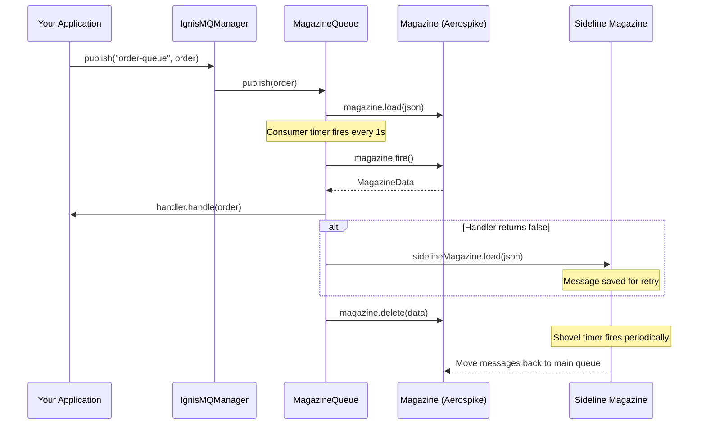
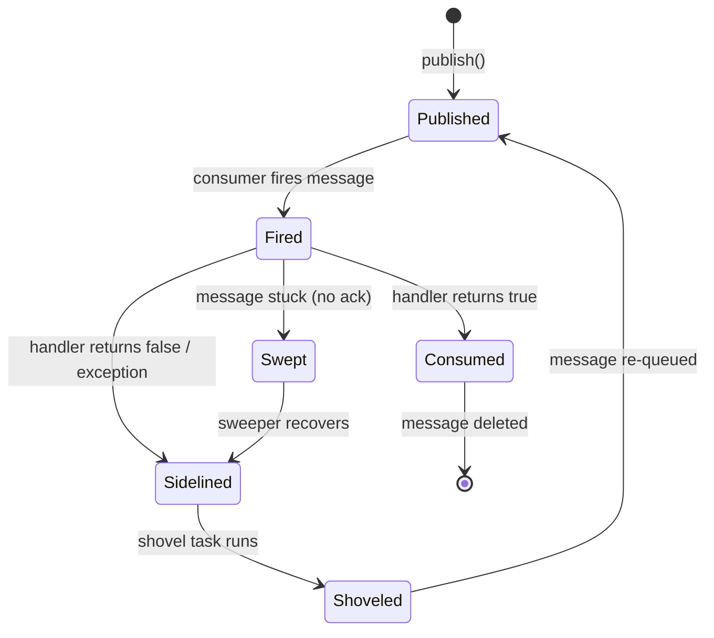
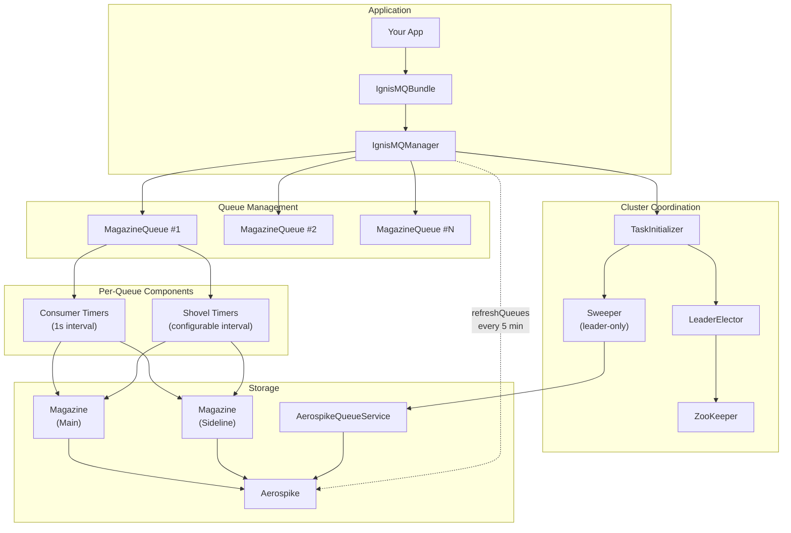

# IgnisMQ

<div style="text-align: center; margin: 2em 0;">
<p style="font-size: 1.2em; color: #666;">
A distributed, persistent, high-throughput message queue for Java
</p>
</div>

---

IgnisMQ is a Java library that provides reliable asynchronous message processing built on top of [Magazine](https://github.com/PhonePe/Magazine) and Aerospike, with first-class Dropwizard integration for microservice environments.

## Key Features

<div class="grid cards" markdown>

-   :material-lightning-bolt:{ .lg .middle } **High Throughput**

    ---

    Backed by Aerospike — handles millions of messages per second with sub-millisecond latency. Sharded queues distribute load across the cluster.

-   :material-shield-check:{ .lg .middle } **Reliable Delivery**

    ---

    Failed messages are automatically **sidelined** and can be **shoveled** back for reprocessing. Stuck messages are **swept** and recovered.

-   :material-account-group:{ .lg .middle } **Distributed Coordination**

    ---

    ZooKeeper-based **leader election** ensures exactly one sweeper runs across the cluster. Load balancing distributes partitions across nodes.

-   :material-tune:{ .lg .middle } **Configurable Everything**

    ---

    Concurrency, TTLs, batch sizes, shovel intervals, sweep durations — every aspect of queue behavior is tunable at runtime.

</div>

## How It Works



## Quick Start

=== "Dropwizard Bundle"

    ```java
    // 1. Extend the bundle
    public class MyIgnisMQBundle extends IgnisMQBundle<MyConfig> {
        @Override
        protected BaseStorage getStorage(MyConfig config) {
            return new AerospikeStorage(config.getAerospikeConfig(), "my-ns");
        }
        @Override
        protected String getClientId(MyConfig c) { return c.getClientId(); }
        @Override
        protected String getFarmId(MyConfig c) { return c.getFarmId(); }
        @Override
        protected CuratorFramework getCuratorFramework() { return curator; }
    }

    // 2. Register in your Application
    bootstrap.addBundle(ignisMQBundle);

    // 3. Initialize handlers and create a queue
    manager.initialiseMessageHandlers(Map.of(
        "order-handler", Map.entry(Order.class, new OrderHandler())
    ));

    manager.createQueue(CreateQueueRequest.builder()
        .name("order-queue")
        .concurrency(8)
        .messageHandlerType("order-handler")
        .build());

    // 4. Publish messages
    manager.getQueue("order-queue").publish(new Order("ORD-123", 99.99));
    ```

=== "Standalone"

    ```java
    // 1. Create storage and manager
    BaseStorage storage = new AerospikeStorage(aerospikeConfig, "my-ns");
    IgnisMQManager manager = new IgnisMQManager(
        "my-client", storage, new ObjectMapper(),
        new MetricRegistry(), curatorFramework, "farm-1"
    );

    // 2. Register handlers
    manager.initialiseMessageHandlers(Map.of(
        "order-handler", Map.entry(Order.class, new OrderHandler())
    ));

    // 3. Create a queue and publish
    manager.createQueue(CreateQueueRequest.builder()
        .name("order-queue")
        .concurrency(4)
        .messageHandlerType("order-handler")
        .build());

    manager.getQueue("order-queue").publish(new Order("ORD-123", 99.99));
    ```

## Message Lifecycle at a Glance



## Architecture Overview



## What to Read Next

| Page | Description |
|------|-------------|
| [Getting Started](getting-started.md) | Prerequisites, installation, and your first queue in 5 minutes |
| [Core Concepts](core-concepts.md) | Message lifecycle, sidelining, shoveling, sweeping, leader election |
| [Usage Guide](usage.md) | Complete examples — Dropwizard, standalone, batching, shoveling |
| [Architecture](architecture.md) | Component deep-dive, threading model, data flow |
| [API Reference](api/api-reference.md) | Every class, method, and field documented |
| [Configuration](api/configuration.md) | All configuration options with defaults and constraints |
| [Error Codes](api/error-codes.md) | Complete error catalog with causes and solutions |
| [Aerospike Backend](backends/aerospike.md) | Data model, indexing, sweep internals |
| [References](references.md) | Academic and industry work that inspired IgnisMQ's design |
